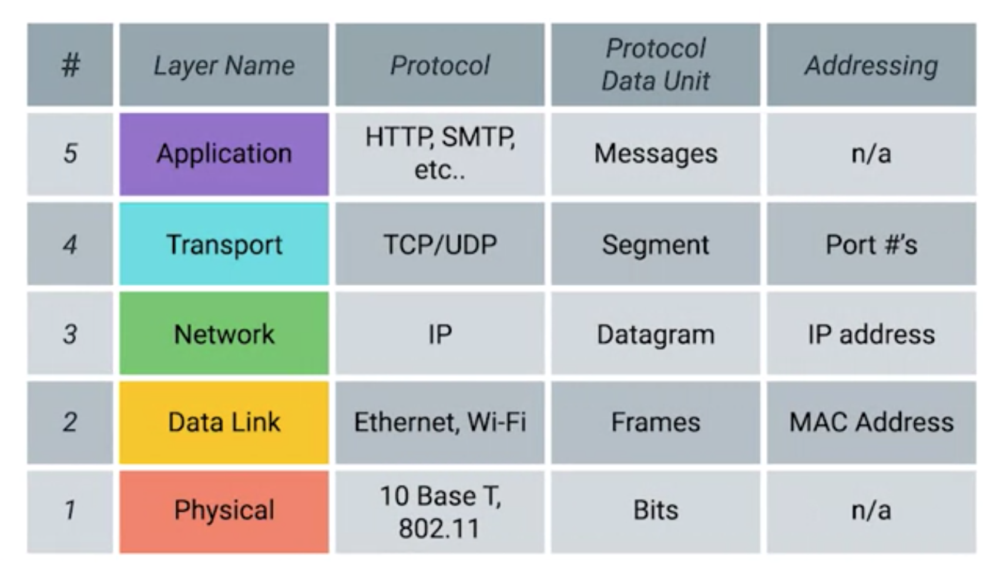

## Five Layer Model Overview

## Physical Layer
* It represents the physical devices that interconnect computers.
  * includes specifications for the networking cables and the connectors that join devices together along with specifications describing how signals are sent over these connections.
* all about cabling
* devices
  * cable

## Data Link
* overview
  * first layer that has protocol
  * also called network interface network access layer.
  *  is responsible for defining a common way of interpreting these signals, so network devices can communicate.
* protocols
  * ethernet
    * specifying physical layer attributes
    * the Ethernet standards also define a protocol responsible for getting data to nodes on the same network or link.
* deliver data through single link
* devices
  * your computer + local network(cable or wifi)

## Network Layer
  * also called Internet Layer
  * deliver data between two individual nodes
    * client and server
  * allows different networks to communicate with each other through devices known as routers.
  * deliver data across a collection of networks.
  * It's the network layer that helps gets the data between these two locations. Your home computer to remote server.
  * devices
    * router

### Internet
* A collection of networks connected together through routers is an internetwork, the most famous of these being the Internet

### Multiple Services
* client and Server may have different Services on same computer
  * email service
  * browser service

## Transport Layer
* receives data from Network Layer and sorts out which client and server ***programs/applications*** are supposed to get that data.
* protocols
  * transmission conrtorl protocol (TCP)
  * User Datagram Protocol (UDP)
  * TCP provides mechanisms to ensure that data is reliably delivered while UDP does not.

## Application Layer
  * Protocols used to allow you to browse the web or send receive email are some common ones.

## Conclusion

You can think of layers like different aspects of a package being delivered. The physical layer is the delivery truck and the roads. The data link layer is how the delivery trucks get from one intersection to the next over and over. The network layer identifies which roads need to be taken to get from address A to address B. The transport layer ensures that delivery driver knows how to knock on your door to tell you your package has arrived (knock on doors and call the right person to receive the package). And the application layer is the contents of the package itself.
