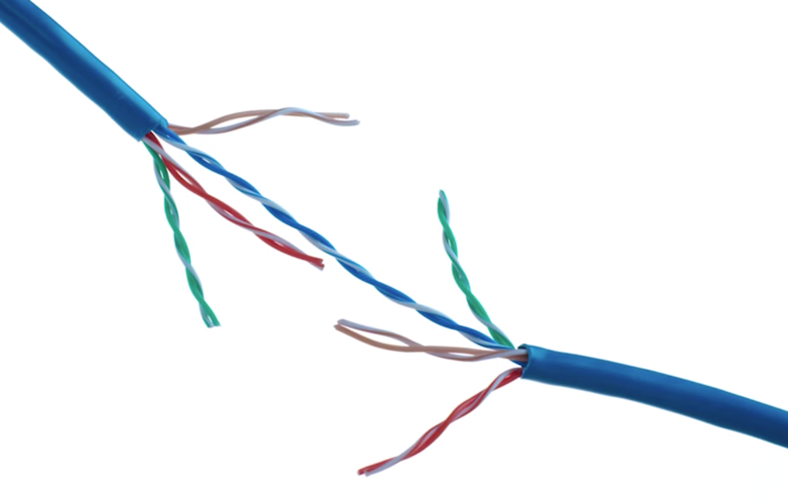

## Twisted Pair
* The most common type of cabling used for connecting computing devices
* twisted nature helps protect against electromagnetic interference and crosstalk from neighboring pairs

## cat 6 cable
* Duplex communication
* A standard cat six cable has eight wires consisting of four twisted pairs inside a single jacket.
  * The way networking cables ensure that duplex communication is possible is by reserving one or two pairs for communicating in one direction. They then use the other one or two pairs for communicating in the other direction.
* devices on either side of a networking link can both communicate with each other at the exact same time.

## Duplex communication
* is the concept that information can flow in both directions across the cable.

## Simplex Communication
* is unidirectional

## Full Duplex
* user cat 6 cable, two ends can communicate to each other at same time (simultaneously)

## Half Duplex
* while communication is possible in each direction, only one device can be communicating at a time.

## Duplex
* Full duplex allows communications in two directions at the same time; half duplex means that only one side can communicate at a time.

## Current Physical Layer
* duplex communication

## Extended Reading
* https://www.youtube.com/watch?v=_NX99ad2FUA
