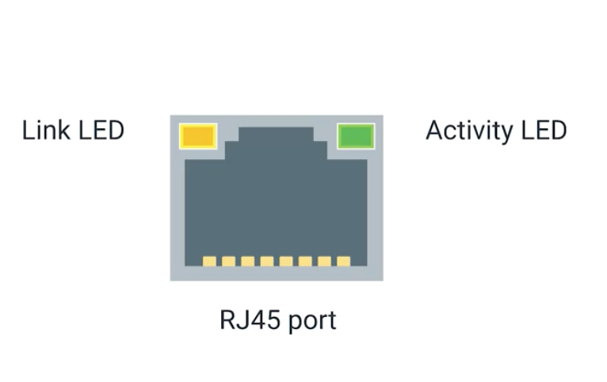
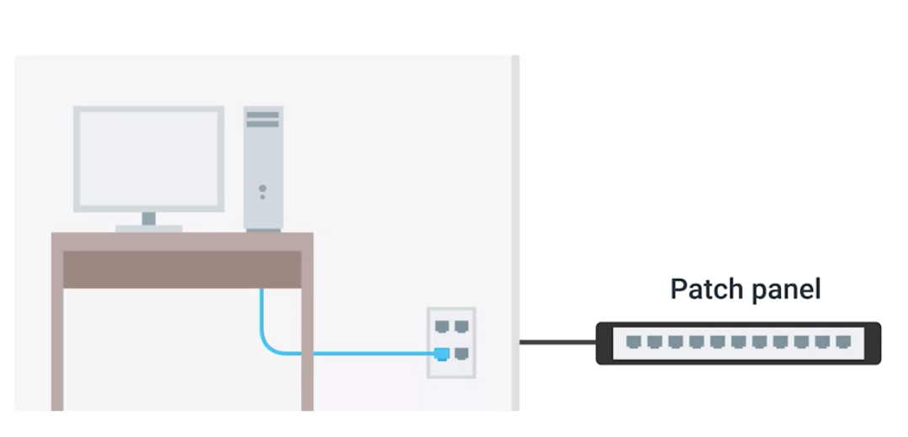

## Cable
* take cat5e for example
  * then end of cable is a plug
    * takes the individual internal wires and exposes them.
    * most common plug is known as an RJ-45 or Registered Jack 45
* put the plug into Network Port of computer, router, switch, modem, etc.

## Network Ports
* most of the port has two LED lights
  1. link light
  2. activity light

* Link Light
  * will be lit when a cable is properly connected to two devices that are both powered on

* Activity Light
  * will flash when data is actively transmitted across the cable

* switches
  * sometimes the same LED is used for both link and activity status. It might even indicate other things like links speed.

* two cases
  * network port's device to network port's device
  * network port's device -> wall -> patch panel

## Patch Panel

* Patch panel is a device containing many net ports but it does no other work.
* a container for the endpoints of many runs of cable
* Additional cables are then generally ran from a patch panel to switches or routers to provide network access to the computers at the other end of those links

* overview
  * multiple devices -> wall -> patch panel -> single switch/router -> outter network -> nodes -> server.
