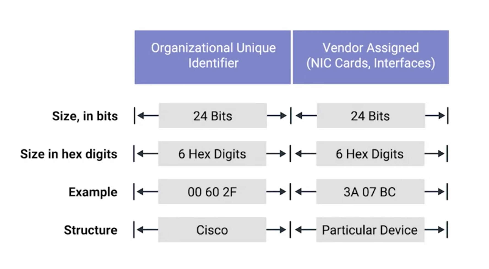

## Data Link Layer
* protocols
  * ethernet
    * use MAC Address
  * wi-fi (use another protocol)

## What you have to learn for data link layer
  * mac address
  * unicast, multicast and broadcast addresses.
  * how cyclical redundancy checks help ensure the integrity of data sent via Ethernet.

## Ethernet (with hub)
* in 1983, we still have no switch or switchable hub
  * cause collision domain
    * two connected devices send data at the smae time, the electrical signal will be interrupted.
* carrier sense multiple access with collision detection **(CSMA/CD)**
  * solve collision domain
  * is used to determine when the communications channels are clear and when the device is free to transmit data
  * the competing packets are discarded and re-sent one at a time. This becomes a source of inefficiency in the network.
  * how it works
    * If there's no data currently being transmitted on the network segment, a node will feel free to send data.
    * if two devices send data at same time, the computers detect this collision and stop sending data.
    * Each device involved with the collision then waits a random interval of time before trying to send data again.
      * the waiting interval prevent collision domain

## Media Access Control Address (MAC Address) (Ethernet with switch)
* is a globally unique identifier attached to an individual network interface
* a 48-bit number normally represented by six groupings of two hexadecimal(16) numbers.
 * Another way to reference each group of numbers in a MAC address is an octet.
 * xxxx xxxx (1 octet, 8 bits with binary), XX  (2 bit in hexadecimal) -> 3 * (1001 0010) || 6 * (ff)
*  total number of a possible MAC addresses that could exist is 2^48 or 281,474,976,710,656 unique possibilities.
* has two section
  * Organizationally Unique Identifier (OUI) section
  * manufacturer assigned section

### Organizationally Unique Identifier
* The first three octets of a MAC address
*  These are assigned to individual hardware manufacturers by the IEEE or the Institute of Electrical and Electronics Engineers.
* used to identify the manufacturer of a network interface

### Manufacturer Assigned Section
* assigned by manufacturer
* need to mak MAC Address unique globally

## Ethernet + MAC Address
* reduce collision domain.

Ethernet uses MAC addresses to ensure that the data it sends has both an address for the machine that sent the transmission, as well as the one that the transmission was intended for. In this way, even on a network segment, acting as a single collision domain, each node on that network knows when traffic is intended for it.
