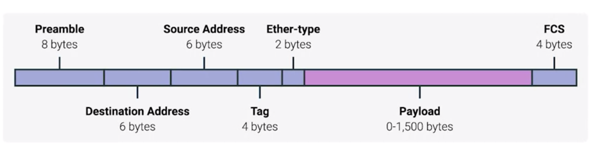

## Data Packet
* represents any single set of binary data being sent across a network link.
* isn't tied to any specific layer or technology

## Ethernet Frames
* data packet in Ethernet Level called **Ethernet Frames**
  * highly structured collection of information presented in a specific order
* sections of an Ethernet
  * most of them are mendatory
  * have a fixed size

* Premable
  * informs the receiving system that a frame is starting and enables synchronisation.
* SFD (Start Frame Delimiter)
  * last byte of Preamble
  * signifies that the Destination MAC Address field begins with the next byte.
* Destination Address
  * MAC address
  * identifies the receiving system.
* Source MAC
  * identifies the sending system.
* Ether-Type
  * defines the type of protocol inside the frame, for example IPv4 or IPv6.
* VLAN
  * the device is attached to which VLAN
* Payload
  * the actual data being transported
  * can be anywhere from 46 to 1500 bytes long
  * This contains all of the data from higher layers such as the IP, transport and application layers.
* Frame Check Sequence
  * a 4-byte or 32-bit number that represents a checksum value for the entire frame.
  * is calculated by performing what's known as a cyclical redundancy check (CRC) against the frame
  * important concept for data integrity
  * Anytime you perform a CRC against a set of data, you should end up with the same checksum number.
  * make sure the receiver receive incourrpted data.
  * step by step
    1. a device ready to send data
    2. collect all information (assembled data)
      * destination MAC address
      * originating MAC addresses
      * the data payload
    3. performs a CRC against that assembled data to create checksum number
    4. receiver receive the packet and perform CRC against the assembled data should produce the same checksum number in the packet.

## Virtual LAN (VLAN)
* goal
  * In office, IT will seperate LAN to two different part.
    * one for employess
    * one for guest
* in old way
  * has tow different switchs
* VLAN
  * Each VLAN is separated logically (like partition) from each other
  * Multiple networks/LANS on the smae physical switch
  * provide logical segamation of networks

## Checksum
* if the checksum sequence is not consistent between sender and receiver, the data should be dropped.
* ethernet only report on data integrity, other network layers will decide if the data should be re-transmitted. 

## References
[good ref](https://study-ccna.com/ethernet-frame/)
[VLAN](https://www.youtube.com/watch?v=oo-hejIq3iQ)
