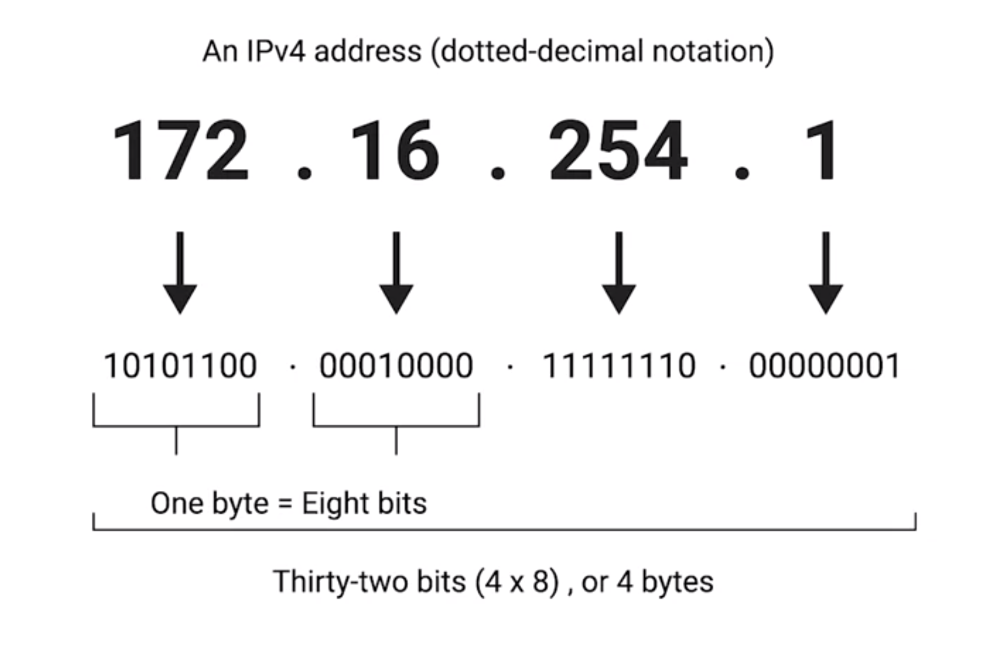

# IP Address

## Overview
* 32-bits === 4 octets (4 * (1001 0010))
* usually each octet described in decimal numbers.
  * 8 bits
  * 0 - 255
* format
  * dotted decimal notation
    * 12.34.56.78
* IP addresses belong to the networks, not the devices attached to those networks.
* Each independent LAN has its own unique IP address
  * The LAN at the Internet cafe or the LAN at your house would each be individually responsible for handing out an IP address to your laptop if you power it on there.

#### Example
* 12.34.56.78
  * valid IP address
* 123.456.789.100
  * invalid IP address
    * 456 is greater then 2^8 - 1

## IP address hierarchy

#### Overview
* are distributed in large sections to various organizations and companies, instead of being determined by hardware vendors
* IP addresses are more hierarchical, and easier to store data about than physical addresses are.

#### Example
* Say, IBM owns every single IP that has the number 9 as the first octet.
* Internet router check destination IP Address
  1. 9.0.0.1
  2. send the IP datagram to IBM's routers
  3. The IBM's router can handle the rest of the delivery process from there.

## Dynamic Host Configuration Protocol (DHCP)
* connect new devices (what kind of devices ????) to network, it will be assigned a dynamic IP address by (DHCP)
* In most cases
  * static IP addresses are reserved for servers and network devices
  * dynamic IP addresses are reserved for clients
