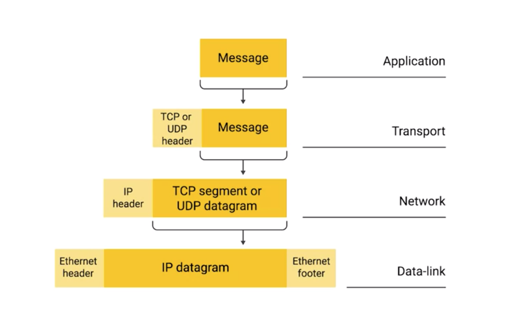

# IP Datagram

## Overview
* data name
  * data-link layer (layer 2) -> Ethernet -> ethernet frame
  * Network Layer (layer 3) -> IP -> IP datagram
* highly structured series of fields that are strictly defined

## Structure
* two primary sections
  1. header
  2. payload

### Sections

##### Header
* Version
  * 4-bits
  * indicates what version of Internet protocol is being used.
    * IPv4
    * IPv6

* Header Length Field
  * 4-bits
  * declares how long the entire header is.
  * unit
    * unit of IP datagram is 32-bit word
  * `(2^4 - 1) * 32 = 480; 480 / 8 = 60` -> max length === 60 bytes
  * minimum length
    * 20 bytes
      * minimum length to include all necessary information to form a proper IP datagram
    * IPv4
      * almost always 20 bytes in length

* Service Type Field
  * specify details about quality of service or QoS technologies
  * Quality of Service Technologies (QoS)
    * description or measurement of the overall performance of a network service
    * main elements
      1. packet loss
      2. bit rate
      3. throughput
      4. transmission delay
      5. availability
      6. jitter
    * allow routers to make decisions about which IP datagram may be more important than others
  * Contains a 3-bit precedence field (that is ignored today), 4 service bits, and 1 unused bit.
    * The four service bits can be:
      * 1000 - minimize delay
      * 0100 - maximize throughput
      * 0010 - maximize reliability
      * 0001 - minimize monetary cost
    * This is a "hint" of what characteristics of the physical layer to use
      * Basically, tell physical layer what characteristics it should perform, e.g., maximize reliability

* Total Length Field
  * 16-bits
  * to indicate the total length of the IP datagram it's attached to
  * maximum size of a single datagram
    * 2 ^ 16 - 1 = 65,535

* Identification
  * 16-bits
  * used to group messages together.
  * Usually incremented by 1 each time a datagram is sent
  * scenario
    1. data is too big to fit in to single datagram
    2. split data to multiple packets/fragments
    3. all fragments has same Identification value
    4. destination host to determine which fragment belongs to which datagram and put them all back together.

* Flags && Fragment Offset
  * 3-bits, 13 bits
  * flag field
    * used to indicate if a datagram is allowed to be fragmented, or to indicate that the datagram has already been fragmented.
  * Fragment Offset
    * contains values used by the receiving end to take all the parts of a fragmented packet and put them back together in the correct order.
    * This is used to aid the reassembly of the full datagram. The value in this field contains the number of 64-bit segments (header bytes are not counted) contained in earlier fragments. If this is the first (or only) fragment, this field contains a value of zero.

* Time To Live (TTL)
  * 8-bits
  * how many router hops a datagram can traverse before it's thrown away.
  * Every time a datagram reaches a new router, that router decrements the TTL field by one
  * if the value is zero
    * the router will not forward the datagram
  * to prevent endless loop
    * router A think data should hop to router B
    * router B think data should hop to router A

* Protocol Field
  * 8-bits
  * indicate what transport layer protocol is being used
    * TCP
    * UDP

* Header Checksum Field
  * is a checksum of the contents of the entire IP datagram header
  * perform a CRC (Cylical Redundancy Check)  against datagram header to get checksum value
  * Since the TTL field has to be recomputed at every router that a datagram touches, the checksum field necessarily changes, too.

* Source/Destination IP Address
  * 32-bits

* Options
  * is used to set special characteristics for datagrams primarily used for testing purposes.
  * example
    1. intermediate router put the following
      * IP addresses
      * time stamp
    2. final destination knows how long it took to get to each hop

* Padding Field
  * Since the IP options field is both optional and variable in length, the padding field is just a series of zeros used to ensure the header is the correct total size.

##### Payload
* IP datagram be wrapped into the payload section of Ethernet Frame
* payload of IP datagram composed with TCP segment or UDP datagram

## Encapsulation
* IP datagram be wrapped into the payload section of Ethernet Frame

## Fragmentation
* Fragmentation is the process of taking a single IP datagram and splitting it up into several smaller datagrams
* a datagram has to cross from a network allowing a larger datagram size to one with a smaller datagram size, the datagram would have to be fragmented into smaller ones.

## Date Type
* byte = 8 bits
* word = 16 bits
* doublewords = 32 bits
* quadword = 64 bits

## References
* [data type](https://cse.unl.edu/~goddard/Courses/CSCE351/IntelArchitecture/IntelDataType.pdf)
* [IP header #1](http://telescript.denayer.wenk.be/~hcr/cn/idoceo/ip_header.html)
* [IP header #2](http://mars.netanya.ac.il/~unesco/cdrom/booklet/HTML/NETWORKING/node020.html)
* [header length](https://networkengineering.stackexchange.com/questions/6855/maximum-ipv4-header-size)
* [QoS](https://en.wikipedia.org/wiki/Quality_of_service)
