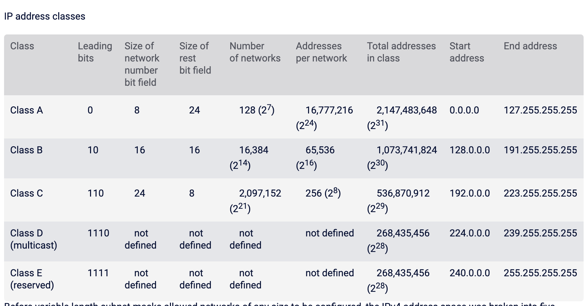
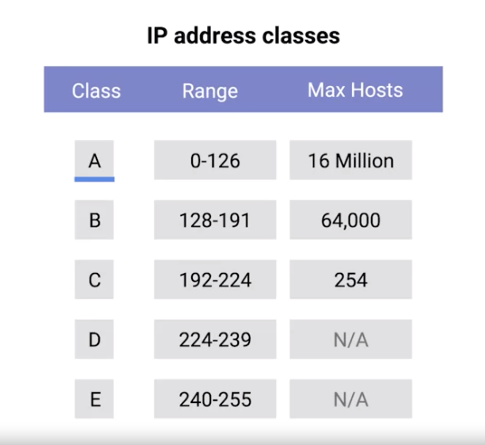

# IP Address Classes

## Overview
  * 32-bits === 4 octets
  * two sections
    * network ID
      * first octet of IP Address
      * all devices on same network segment having same network ID
    * host ID
      * second, third and fourth octets
  * Example
    * IBM owns all IP addresses that having a nine as the value of the first octet in an IP address.

## Address Class System
* is a way of defining how the global IP address space is split up

#### Three Primary Classes
* Classes
  * Class A
    * sections
      * the first octet is used for the network ID
      * the last three are used for the host ID.
    * leading bits
      * 0
    * first decimal range
      * 0 - 127
  * Class B
    * sections
      * the first two octets are used for the network ID
      * the second two, are used for the host ID.
    * leading bits
      * 10
    * first decimal range
      * 128 - 191
        * (127 + 2^6) = 191
  * Class C
    * sections
      * the first three octets are used for the network ID
      * the final octet is used for the host ID.
    * leading bits
      * 110
    * first decimal range
      * 192 - 223
        * (191 + 2^5) = 223
    * max number of ip address (host address) is 254
      * (2 ^ 8) - 2 = 254
        * When calculating hosts' IP addresses, 2 IP addresses are decreased because they cannot be assigned to hosts, i.e. the first IP of a network is network number and the last IP is reserved for Broadcast IP.

 
 

#### Other Classes
* Class D addresses always begin with the bits 1110, and are used for multicasting, which is how a single IP datagram can be sent to an entire network at once. These addresses begin with decimal values between 224 and 239.

* class E addresses make up all of the remaining IP addresses, but they're unassigned and only used for testing purposes.

## Classless Inter-Domain Routing (CIDR)
  * Replace old Address Class System
  * Rather than have prefixes only of length 8, 16, and 24 bits, CIDR allows prefixes to be any number of bits
  * /14: mean a netmask of length 14. -> has 2^18 different IP address
  * Address block is a pair: address,count
  * Counts are powers of 2, specify netmask length
  * 171.64.0.0/16 means any address in the range 171.64.0.0 to 171.64.255.255
  * A /24 describes 256 addresses, a /20 describes 4,096 addresses

## References
* [IP_ADDRESS_CLASS](https://www.paessler.com/it-explained/ip-address)
* [IP4_address_class](https://www.tutorialspoint.com/ipv4/ipv4_address_classes)
