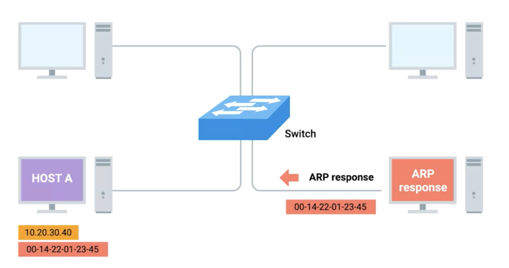

# Address Resolution Protocol (ARP)

## Overview
* Data Link Layer Protocol
* a protocol used to discover the hardware address of a node with a certain IP address.
* The address resolution protocol (arp) is a protocol used by the Internet Protocol (IP) [RFC826], specifically IPv4, to map IP network addresses to the hardware addresses used by a data link protocol.
* link private IP address to connected device's MAC address

## Ethernet Frame
* How to form
  1. IP datagram
  2. encapsulate the IP datagram into Ethernet frame
    * the transmitting device needs an destination MAC Address to complete Ethernet frame header

* network connected devices
  * contains an ARP table

## ARP Table
* is just a list of IP addresses and the MAC addresses associated with them.

## How ARP Works

* Computer A <-> Switch <-> Computer C
  * in LAN
* Computer A
  * IP Address: 192.168.1.1
  * MAC Address: AA:AA:AA:AA:AA:AA
* Computer B
  * IP Address: 192.168.1.2
  * MAC Address: ??
* steps
  1. A wanna send data to B
    * A only knows the private IP Address of B
  2. A puts IP datagram into Ethernet Frame
    * source MAC Address: AA:AA:AA:AA:AA:AA
    * destination MAC Address: ???
  3. A broadcast ARP Request in the LAN (local network segment)
    * A: I provide my IP and MAC Address, I am looking for MAC Address of IP Address (192.168.1.2)
  4. B receive broadcasted message
    1. It has ARP table
      * create an entry: 192.168.1.1 -> AA:AA:AA:AA:AA:AA
    2. Send ARP reply
      * contain its IP/MAC Address.
        * MAC Address: BB:BB:BB:BB:BB:BB
  5. A receive B's ARP reply
    * It has ARP table
      * create an entry: 192.168.1.2 -> BB:BB:BB:BB:BB:BB
  6. A creates proper Ethernet Frame (encapsulate IP datagram) with correct destination MAC Address

  

## Note
  * ARP table entries generally expire after a short amount of time to ensure changes in the network are accounted for.

## Broadcast
* Broadcast is possible also on the underlying data link layer in Ethernet networks. Frames are addressed to reach every computer on a given LAN segment if they are addressed to MAC address FF:FF:FF:FF:FF:FF. Ethernet frames that contain IP broadcast packages are usually sent to this address.

## References
* [ARP](https://www.youtube.com/watch?v=xTOyZ6TWQdM)
* [Broadcast](https://en.wikipedia.org/wiki/Broadcast_address)
