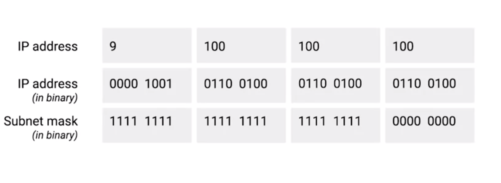
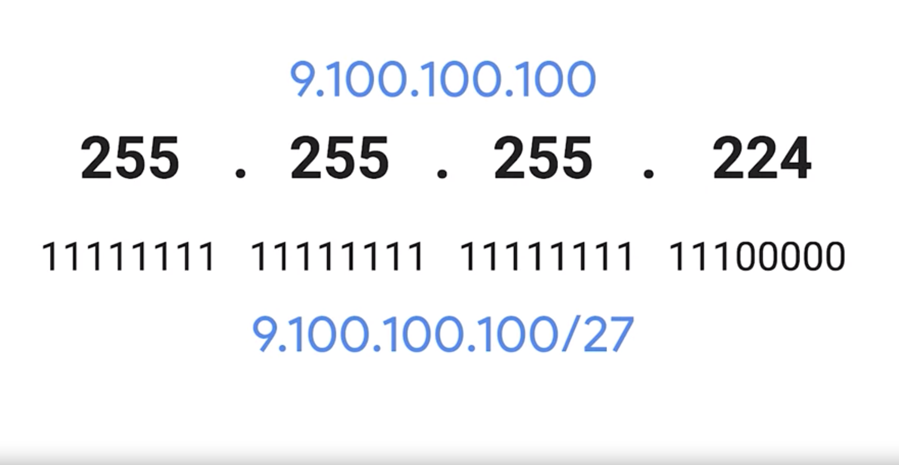

# Subnet Masks

## Prerequisite
* IP Address
  * 32-bit number
* IP Address has two sections (without subnet)
  1. network IDs
    * identify networks
  2. host IDs
    * identify individual host

## IP with Subnet
* some bits that would normally comprise the host ID are actually used for the subnet ID.

## Routers Hierarchy (Layer 3 / Network Layer)
1. core routers
  * only care about network ID
  * send the datagram to the appropriate gateway router
2. gateway router
  * has some additional information that it can use to send that datagram along to the destination machine or the next router in the path to get there.
3. last router
  * the host ID is used by that last router to deliver the datagram to the intended recipient machine.

## How to get Subnet IDs
* are calculated via subnet mask

## Subnet Mask
* 32-bit numbers
* four octets in decimal
* purpose
  * The purpose of the mask or the part that's all ones is to tell a router what part of an IP address is the subnet ID.
* two sections
  1. The beginning part: 1111....
    * for subnet ID
  2. rest part: 000...
    * for hostID

#### Example
* IP Address: 9.100.100.100
* Subnet Mask: 255.255.255.0

 
 

* analyze
  * 9.100.100.100 === 0000 1001, 0110 0100, 0110 0100, 0110 0100
    * network ID
      * first octet (fist 8-bits)
    * supposedly, rest of 3 octets should be host id
      * but subnet mask 255.255.255.0 === 1111 1111, 1111 1111, 1111 11111, 0000 0000
    * the subnet mask of 255.255.255.0
      * only the last octet is available for host IDs, regardless of what size the network and subnet IDs are.
    * host ID === 0110 0100
      * 256 in total, 0 - 255
        * 0 for subnet ID
        * 255 for broadcast
      * only 254 in total (1 - 254)
      * note:
        generally speaking, you'll refer to the number of host available in a subnet as the entire number. So, even if it's understood that two addresses aren't available for assignment, you'd still say that eight bits of host IDs space have 256 addresses available, not 254. This is because those other IPs are still IP addresses, even if they aren't assigned directly to a node on that subnet.

#### Notation

* IP Address: 9.100.100.100
* Subnet mask: 255.255.255.225
  * 1111 1111, 1111 1111, 1111 1111, 1110 0000
    * 27 ones
    * 5 zeros
  * notation /27
* 9.100.100.100/27

