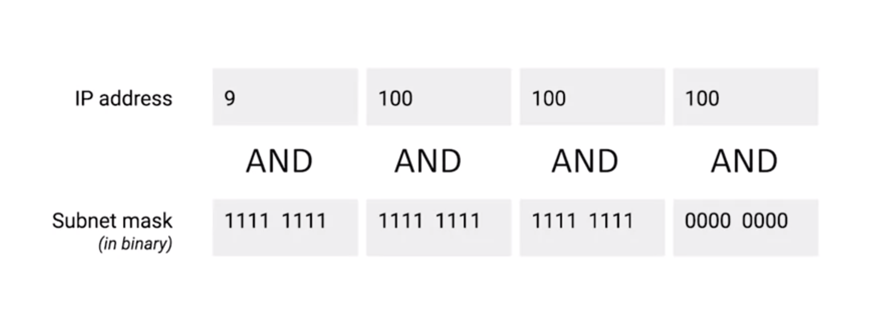

# Binary Math

## Note
* Decimal Numeral System -> base 10
* Binary Numeral System -> base 2

## how many numbers you can represent with bits
* binary
  * xxx -> 2 ^ 3 = 8 (0 - 7)
* decimal
  * xx -> 10 ^ 2 = 100 (0 - 99)

## Addition
*  You carried digit to the next column once you reached 10 in doing decimal edition, you carry a digit to the next column once you reach 2 when doing binary edition.
  * decimal: 10 + 90 = 100
  * binary: 10 + 10 = 100

## OR, AND
* BLABLABLA

## Subnet Mask
*  A subnet mask is a way for a computer to use and operators to determine if an IP address exists on the same network.
* example
  * IP address 9.100.100.100
  * subnet mask 255.255.255.0.
  * ( IP address && subnet mask ) === network ID
    *  9.100.100.
* The computer that just performed this operation can now compare the results with its own network ID to determine if the address is on the same network or a different one.

