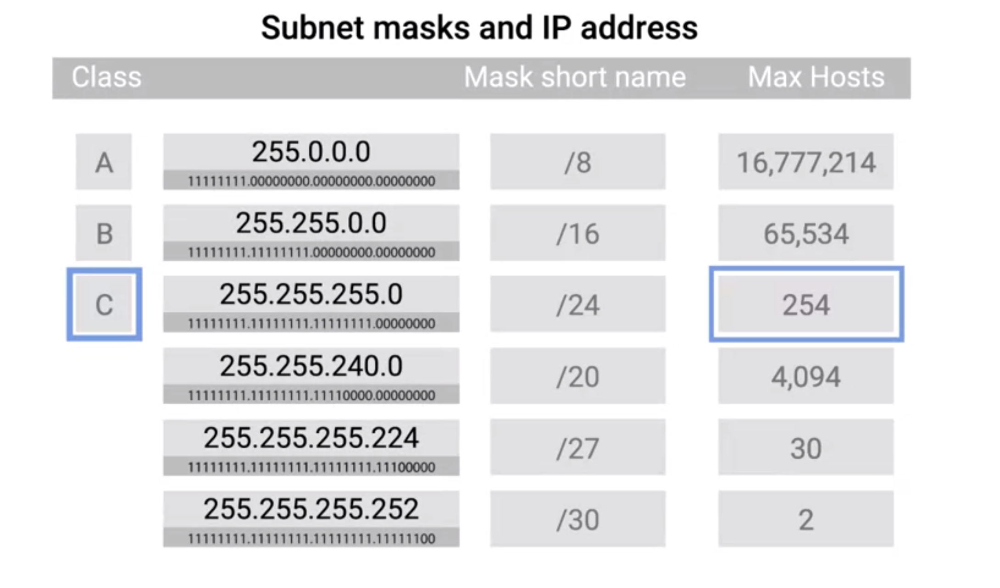
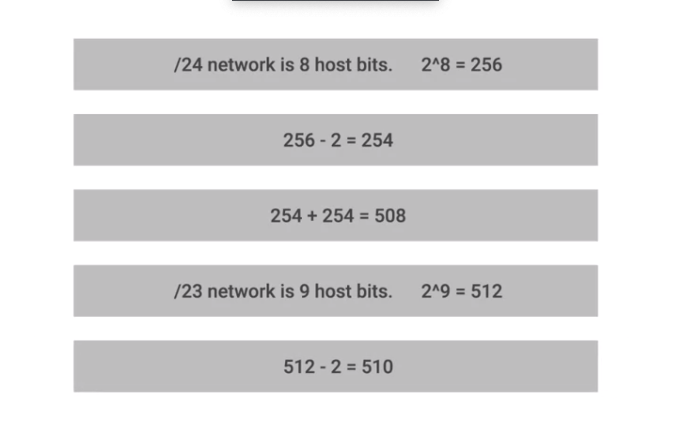

# CIDR
* Classless Inter-Domain Routing

## Overview
* How to organize network IP address
  1. address Classes
  2. Subnet
*  Internet continued to grow, traditional subnetting just couldn't keep up.
  * solution: CIDR

## Problem

* class C
  * 254 hosts
  * 2,970,152 class networks
    * 24-bits - 3 lead bits
    * (2 ^ 21) = 2,970,152
  * problem
    * 254 hosts in a class C network is too small for many use cases
* class B
  * 65,534 hosts
    * 65536 - 2
      * one for class network
      * one for broadcast IP Address
  * problem
    * 65,534 hosts available for use in a class B network is often way too large
    * To illustrate the problems with the class system, consider that one of the most commonly used classes was Class B. An organization that needed more than 254 host machines would often get a Class B license, even though it would have far fewer than 65,534 hosts. This resulted in most of the block of addresses allocated going unused. The inflexibility of the class system accelerated IPv4 address pool exhaustion. With IPv6, addresses grow to 128 bits, greatly expanding the number of possible addresses on the Internet. The transition to IPv6 is slow, however, so IPv4 address exhaustion continues to be a significant issue.

* address classes
  * static/strict ip address allocation
  * only subnets could be of different sizes

### Expediment
* Many companies ended up with various adjoining class C networks to meet their needs. That meant that routing tables ended up with a bunch of entries for a bunch of class C networks that were all actually being routed to the same place.

## CIDT comes to Help
* Review
  * In our previous model, we relied on a network ID, subnet ID, and host ID to deliver an IP datagram to the correct location.
#### CIDR Overview
  * the network ID and subnet ID are combined into one.
  * is where we get this shorthand slash notation
  * the slash notation is also known as CIDR notation
  * abandons the concept of address classes entirely
  * defined by only two Individual IDs.

#### Example
  * prerequisite: abandon address classes rule
  * 9.100.100.100 with a net mask of 255.255.255.0.
    * 9.100.100.100/24
      * networkId: 9.100.100
      * hostId: 0.0.0.100

#### Benefits
* simplifies how routers and other network devices need to think about parts of an IP address,
* arbitrary network sizes

## Scenario with CIDR (benefit)
1. Before this, if a company needed more addresses than a single class C could provide, they need an entire second class C. With CIDR, they could combine that address space into one contiguous chunk with a net mask of /23 or 255.255.254.0. This means, that routers now **only need to know one entry** in their routing table to deliver traffic to these addresses instead of two.

2. It's also important to call out that you get additional available host IDs out of this practice. Remember that you always lose two host IDs per network. So, if a /24 network has two to the eight or 256 potential hosts, you really only have 256 minus two, or 254 available IPs to assign. If you need two networks of this size, you have a total of 254 plus 254 or 508 hosts. A single /23 network, on the other hand, is two to the nine or 512. 512 minus two, 510 hosts.

## Terms
* democration point
  * to describe where one network or system ends and another one begins.

## References
[why we need CIDR](https://searchnetworking.techtarget.com/definition/CIDR)
