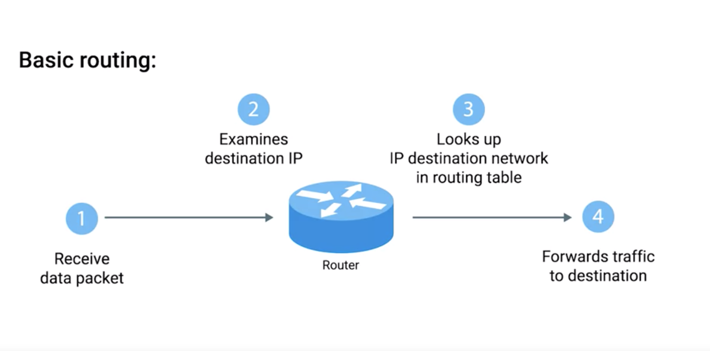
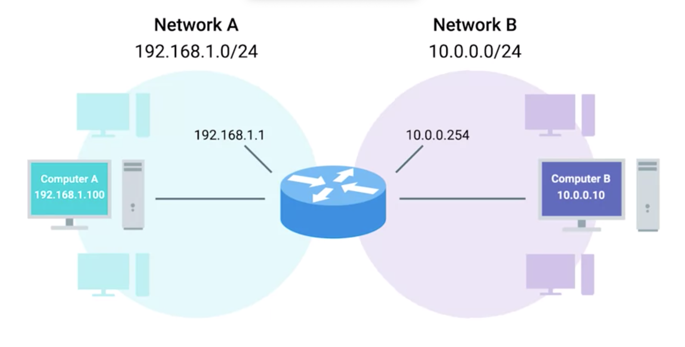
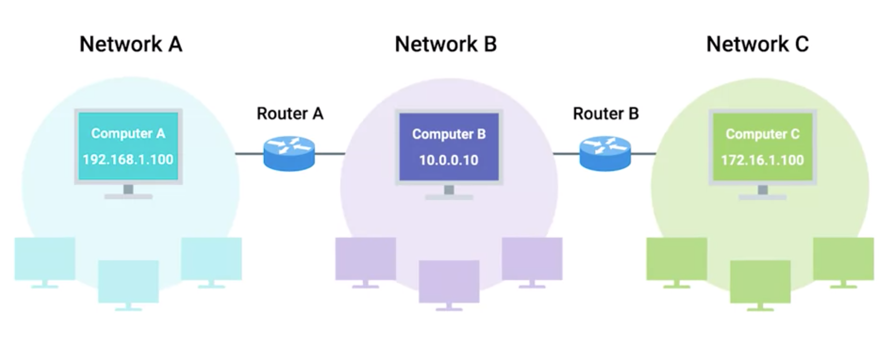

# Routing

## Goal
* understanding basic routing
* how routing table works
* routing protocol
  * what is it for
  * how does it work
* identifying non-routable address space and how it's used
* RFC System

## Note
* Today, most intensive routing issues are almost exclusively handled by ISPs and only the largest of companies.

## Router
* is a network device that forwards traffic depending on the destination address of that traffic
* has at least two network interfaces, since it has to be connected to two networks to do its job.
  * each interface has one IP Address

##### Basic Routing
1. a router receives a packet of data on one of its interfaces
2. the router examines the destination IP of this packet
3. the router then looks up the destination network of this IP in its routing table
4. the router forwards that out though the interface that's closest to the remote network.
  * As determined by additional info within the routing table.
  * to next router or arrive destination

##### Example I (one router + two networks)

 
 

* Players
  *  Network A space
    * 192.168.1.0/24
    * Multiple computers in the network A space
      * one computer (computerAA): IP -> 192.168.1.100
  * Network B space
    * 10.0.0.0/24
    * Multiple computers in the network A space
      * one computer (computerBB): IP -> 10.0.0.10
  * router
    * interface A: IP of 192.168.1.1
      * for network A space
    * interface B: IP of 10.0.0.254
      * for network B space      

* goal
  * computerAA send packets to computerBB

* steps
  1. computerAA figures that computerBB is not in same network space
    1. send the packet to the MAC address of its gateway
      * encapsulate Network Layer datagram and all data of all above layers into ethernet frame.
    2. gateway is a router (like the router at your home)
  2. interface A of router receive packets
    1. it receive packets because it sees that destination MAC address belongs to it
    2. remove the data link layer (de-encapsulaiton) to retrieve IP datagram
    3. inspect IP datagram header
      * check destination IP Address (10.0.0.10)
    4. router checks its routing table
      * see Network B (10.0.0.0/24) is the target network space
      * realize network B is directly connected to itself
        * one hop away
        * it even has the MAC address for this IP in its ARP table.
  3. Router forms a new packet
    1. take all data from first IP datagram and duplicates it
      * decrements TTL field by one
      * calculates a new checksum
    2. encapsulates the slightly altered and duplicated IP datagram in to Ethernet frame
    3. sets its own MAC address of the interface on network B as the source MAC address.
    4. check the MAC address of computerBB - 10.0.0.10 in its ARP table
      * set he MAC address as destination MAC address
    5. send the data to network B space
  4. the packet arrive computerBB

##### Example II (one router + three networks)

 
 

* Players
  * Network space A
  * Network space B
  * Network space C
    * has address space of 172.16.1.0/23.
  * Router A
  * Router B
    * interface B: IP of 10.0.0.1
      * for network B space
    * interface C: IP of  172.16.1.1
      * for network C space  

* goal
  * computer at 192.168.1.100 wants to send some data to the computer that has an IP of 172.16.1.100.

* cautious
  * following explanation skip data-link layer (layer two) explanation

* steps
  1. computerAA figures that computerCC is not in same network space
    1. sends a packet to its gateway
      * the router between network space A and B
  2. router A
    * inspect the packet
    * sees a destination address of 172.16.1.100
    * check routing table
      * knows that the quickest way to get to the 172.16.1.0/23 network is via another router (the interface B of router B with IP 10.0.0.1)
    * decrement the TTL and send the packet to interface B (10.0.0.1) of router B
  3. router B
    * knows that the destination IP of 172.16.1.100 is directly connected and forwards the packet to its final destination.

## Notes
*  And finally, in order to protect against breakages, core Internet routers are typically connected in a mesh, meaning that there might be many different paths for a packet to take.

*  Routers inspect the destination IP, look at the routing table to determine which path is the quickest and forward the packet along the path.
