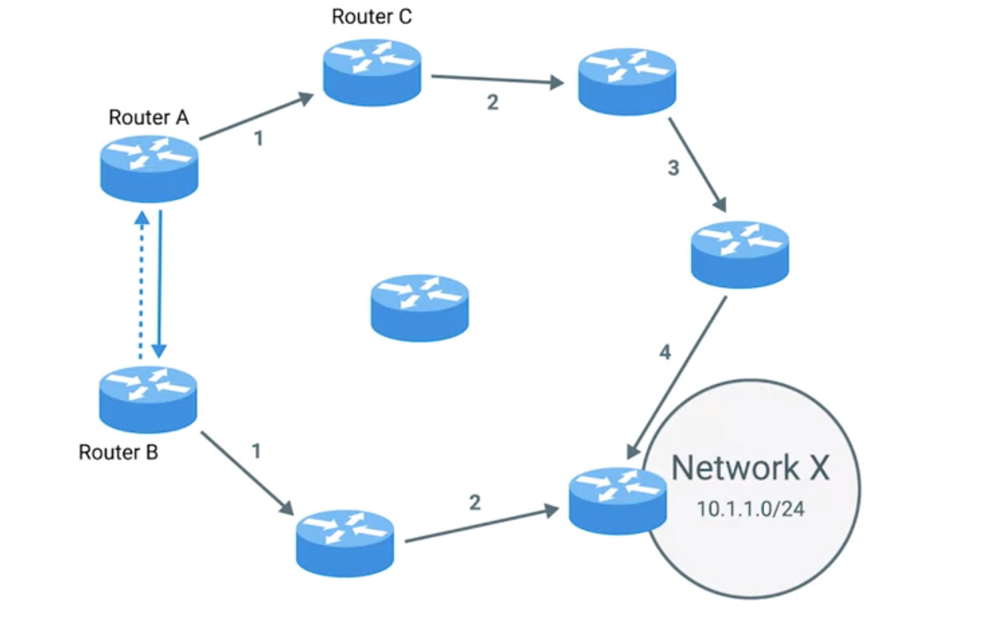
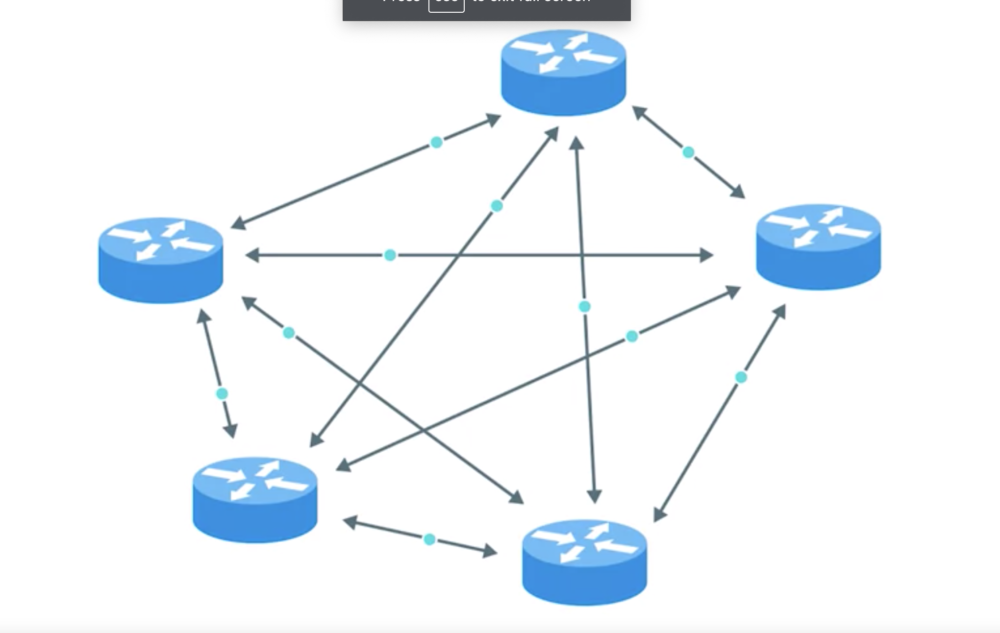

# Interior Gateway Protocol

## Review
* Routing Table
  * routing tables are always updated with new information about the quickest path to destination networks.

## Routing Protocols
  * These are special(multiple) protocols the routers use to speak to each other in order to share what information they might have

#### Overview
* Tow main categories
  1. interior gateway protocols
    * has two sub-categories
      1. Link state routing protocols
      2. distance-vector protocols
    * are used by routers to share information within a single autonomous system
  2. exterior gateway protocols
    * used for the exchange of information between independent autonomous systems
    * ex: Border Gateway Protocol

## Interior Gateway Protocol
* tow sub-protocols
  * goals are similar
  * routers that employ them share different kinds of data to get the job done.

#### distance-vector protocols
* [Explanation](https://www.youtube.com/watch?v=00AAnwgl2DI)
* older standard
* only has information of direct connected router (neighbors)
* tell routing table how far away these networks are in terms of hops.
  * a list of every known network

* Example
  * Router A has a routing table with a bunch of entries. One of these entries is for 10.1.1.0/24 network which we'll refer to as Network X. Router A believes that the quickest path to network X is through its own interface two, which is where router C is connected. Router A knows that sending data intended for Network X through interface two to Router C means it'll take four hops to get to the destination. Meanwhile, Router B is only two hops removed from Network X and this is reflected in its routing table. Router B, using a distance vector protocol, sends the basic contents of it's routing table to Router A. Router A sees that Network X is only two hops away from Router B

  Even with the extra hop to get from Router A to Router B, this means that network X is only three hops away from router A if it forwards data to router B instead of router C. Armed with this new information, router A updates its routing table to reflect this. In order to reach network X in the fastest way, it should forward traffic through its own interface 1 to router B.

 
 
 

* downside
  * have not much information about the state of the world outside of their own direct neighbors
  * slow to react to a change in the network far away from it.

* solution: Link State Routing

#### Link state routing protocols
* take a more sophisticated approach to determining the best path to a network.
* each router advertises the state of the link of each of its interfaces.
  * These interfaces can be connected to other routers or they could be direct connections to networks.
* The information about each router is propagated to every other router on the autonomous system
  * This means that every router on the system knows every detail about every other router in the system.
* require more memory and more processing power.
* gain more information and calculate more precise and shortest path for router.

## Terms
* [autonomous system](https://www.youtube.com/watch?v=ydq4tieEqXE&t=154s)
  * is a collection of networks that all fall under the control of a single network operator (edge router ??).
  * it just like Big LAN
    * Your schools network is an autonomous system
      * your school can have multiple LANs or subnets
    * your ISP is an autonomous system.
  * examples
    * large corporation that needs to route data between their many offices, and each of which might have their own local area network
    * many routers employed by an Internet service provider whose reaches are usually national in scale.
  * The classic definition of an Autonomous System is a set of routers under a single technical administration, using an interior gateway protocol (IGP) and common metrics to determine how to route packets within the AS, and using an inter-AS routing protocol (exterior routing protocol) to determine how to route packets to other ASs. Since this classic definition was developed, it has become common for a single AS to use several IGPs and sometimes several sets of metrics within an AS. The use of the term Autonomous System here stresses the fact that, even when multiple IGPs and metrics are used, the administration of an AS appears to other ASs to have a single coherent interior routing plan and presents a consistent picture of what destinations are reachable through it.
  * Internet is a network of computer networks
    * each computer networks work independently and all computer networks communicate through IP protocol to move packet around. Theres independently operated computer networks are called Autonomous System
  * Example
    * Character
    * single Computer-UB of University of Boston Autonomous System(UBAS) in dorm room
    * single Computer-SU of Stanford University Autonomous System(SUAS) in dorm room
    * Scenario
      * Computer-UB sends packet to Computer-SU
        * steps
          1. Computer-UB send packet to gateway router of UBAS
            * UBAS mind its own business
              * how its computer send data to its gateway router
          2. gateway router figure where to send packet
          3. multiple hops
          4. arrive gateway router of SUAS
          5. SUAS take care the rest and send packet to Computer-SU

## References
[Subnet V.S. Autonomous System](https://www.quora.com/What-is-the-difference-between-an-autonomous-system-and-a-subnet-in-computer-networking)
[cisco - Autonomous System](https://www.cisco.com/c/en/us/about/press/internet-protocol-journal/back-issues/table-contents-12/autonomous-system-numbers.html)
