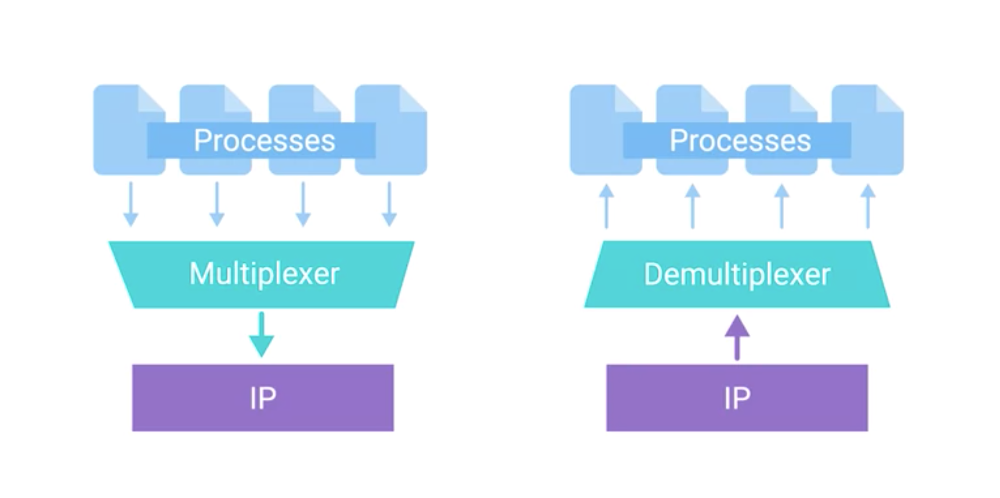

# Transport Layer

## Overview
* is responsible for **reliable** computer networking.
  * multiplexing and demultiplexing traffic
  * establishing long running connections
  * ensuring data integrity through error checking and data verification.

## Course Goal
* What is multiplex && demultiplexing
* Identify difference between TCP and UDP
* three way handshake
* understand how TCP flags are used in this process
* how firewall works

## Multiplexing + Demultiplexing in Transport Layer
* The transport layer has the ability to multiplex and demultiplex, which sets this layer apart from all others.

#### Multiplexing
* means that nodes on the network have the ability to direct traffic toward many different receiving services
  * weird explanation, I don't understand...???
* My note: has the ability to converge multiple process from services to single traffic

#### Demultiplexing
* at the receiving end, it's taking traffic that's all aimed at the same node and delivering it to the proper receiving service.

## Ports
* The transport layer handles multiplexing and demultiplexing through ports.
* what is port
  * 16-bit number
  *  used to direct traffic to specific services running on a networked computer

## Server V.S. Client
* Server
  * has single or multiple programs running on a computer waiting to be asked for data.
* Client request data from server

#### Server
* Different program services listen on different port for incoming requests (on same computer/server)
* single server can provide multiple services through different ports
  * HTTP: 80
    * example
      1. browser surf: http://10.1.1.100 (IP)
      2. the request traffic will be directed to port 80
    * socket address/number
      * 10.1.1.100:80
  * FTP (file transfer protocol)
    * used for file transportation
    * port: 21
    * socket address/number
      * 10.1.1.100:21
* small company's server run multiple services
  * internal website
  * mail server
  * file server (sharing files)
  * print server

## Note
* Multiple services running on single computer is possible because of multiplexing and demultiplexing, and the addition of ports to our addressing scheme

## Terms
* multiplex && demultiplexing
  * The multiplexed signal is transmitted over a communication channel such as a cable. The multiplexing divides the capacity of the communication channel into several logical channels, one for each message signal or data stream to be transferred. A reverse process, known as demultiplexing, extracts the original channels on the receiver end.
  * succinct explanation
    * multiplex
      * transmit several data streams(logical channels (like virtual channels)) in single physical channel such as cable
    * demultiplexing
      * vice-versa
