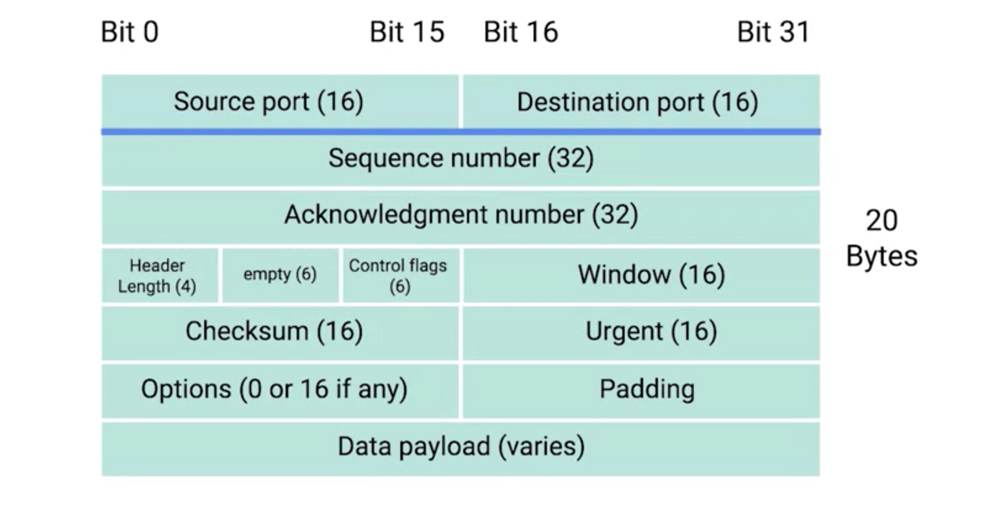

# TCP Segment

## Review (Encapsulation)
* Ethernet Frame
  * header: Ethernet header
  * payload: IP datagram
* IP datagram
  * header: IP header
  * payload: TCP segment
* TCP segment
  * header: TCP header
  * payload
    * data section
      * Application data

## TCP Overview
*  TCP is a protocol that's super reliant on acknowledgements. This is done in order to make sure that all expected data is actually being received and that the sending device doesn't waste time sending data that isn't being received.

## TCP Header

* Destination Port
  * port of the service the traffic is intended for
  * data arrive arrive specific IP Address(server), and be directed to specific port for specific program.
 
 
 
* Source Port
  * high numbered port chosen from a special section of ports known as ephemeral ports.
  * is required to keep lots of outgoing connections separate
  * source port is needed so that when the web server replies, the computer making the original request can send this data to the program that was actually requesting it.
 
 
 
* Sequence Number
  * 32-bit number
  * keep track of where in a sequence of TCP segments this one is expected to be
  * Ethernet Frame has limited size
    * 1,518 bytes
  * TCP segment need more bytes then the limit of ethernet frame
  * TCP split up data into many segments
  * The sequence number in a header is used to keep track of which segment out of many this particular segment might be
  * **how does this work exactly ???**
 
 
 
* Acknowledgement Number
  * is the number of the next expected segment.
  * In very simple language, a sequence number of one and an acknowledgement number of two could be read as this is segment one, expect segment two next.
  * **how does this work exactly ???**
 
 
 
* Data Offset
  * four-bit number
  * indicate how long the TCP header for this segment is.
  * tell the receiving network device understands where the actual data payload begins  
 
 
 
* Control Flag
  * six-bit number
  * six different flags
    1. URG: urgent pointer
    2. ACK: acknowledgment
    3. PSH: push function
    4. RST: reset the connection
    5. SYN: used for setting initial sequence number (three way hand shake)
    6. FIN: end the connection
 
 
 
* TCP window
  * 16-bit number
  * specifies the range of sequence numbers that might be sent before an acknowledgement is required
  * three types
    1. Receive Window (RWIN)
      * The RWIN dictates how much data a TCP receiver is willing to accept before sending an acknowledgement (ACK) back to the TCP sender. The receiver will advertise its RWIN to the sender and thus the sender knows it can’t send more than an RWINs worth of data before receiving and ACK from receiver.
    2. Send Window (SWIN)
      * The SWIN dictates how much data a TCP sender will be allowed send before it must receive an ACK from the TCP receiver.
    3. Congestion Window (CWIN)
      * The CWIN is a variable that changes dynamically according to the conditions of the network. If data is lost or delivered out-of-order the CWIN is typically reduced.
 
 
 
* checksum
  * 16-bit number
  * Once all of this segment has been ingested by a recipient, the checksum is calculated across the entire segment and is compared with the checksum in the header to make sure that there was no data lost or corrupted along the way
 
 
 
* Urgent Field
  * rarely used
  * The Urgent pointer field is used in conjunction(and) with one of the TCP control flags to point out particular segments that might be more important than others
  * these 16 bits are used when the URG (control flag) bit has been set, the urgent pointer is used to indicate where the urgent data ends
 
 
 
* options
  * rarely used
  * sometimes used for more complicated flow control protocols
 
 
 
* padding
  *  just a sequence of zeros to ensure that the data payload section begins at the expected location

## Terms
* ephemeral ports
  * cover later!???

## TO READ
* ephemeral ports
* sequence number

## References
[TCP header](https://www.lifewire.com/tcp-headers-and-udp-headers-explained-817970)
[TCP header #2](https://networklessons.com/cisco/ccie-routing-switching-written/tcp-header)
[TCP Window](https://www.centurylink.com/business/help/network/tcp-windowing.html)
[Sequence Number](https://notfalse.net/26/tcp-seq)
