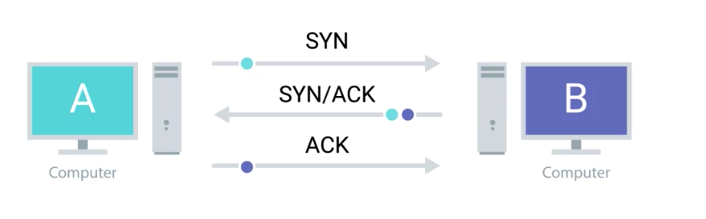
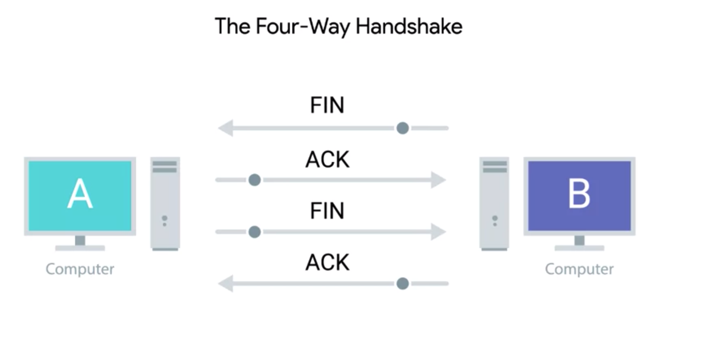

# TCP Control Flags + Three-way handshake

## Comparison
* TCP
  * TCP establishes connections used to send long chains of segments of data
* IP + Ethernet
  * send individual packets of data

## How TCP Establishes Connections
* use of different TCP control flags, used in a very specific order, to open and close connection

## Control Flags
#### 6 control flags
* in the order that they appear in a TCP header
1. URG
  * urgent pointer
  * A value of one here indicates that the segment is considered urgent and that the urgent pointer field has more data about this
  * rarely used
2. ACK
  * acknowledgment
  * A value of one in this field means that the acknowledgment number field should be examined
3. PSH (???)
  * push function
  * that the transmitting device wants the receiving device to push currently-buffered data to the application on the receiving end as soon as possible.
  * buffer
    * is a computing technique, where a certain amount of data is held somewhere, before being sent somewhere else
    * in TCP, it's used to send large chunks of data more efficiently
      * By keeping some amount of data in a buffer, TCP can deliver more meaningful chunks of data to the program waiting for it
      * But in some cases, you might be sending a very small amount of information, that you need the listening program to respond to immediately. This is what the push flag does.

4. RST
  * reset the connection
  * one of the sides in a TCP connection hasn't been able to properly recover from a series of missing or malformed segments
  *  It's a way for one of the partners in a TCP connection to basically say, "Wait, I can't put together what you mean, let's start over from scratch."
5. SYN
  * Synchronize
  * It's used when first establishing a TCP connection and make sure the receiving end knows to examine the sequence number field
6. FIN: end the connection
  * Finish
  * When this flag is set to one, it means the transmitting computer doesn't have any more data to send and the connection can be closed

## Handshake
* A handshake is a way for two devices to ensure that they're speaking the same protocol and will be able to understand each other

## Three-way Handshake
* a way that TCP establishes connection
##### Players
  * computer A
    * transmitting computer
  * computer B
    * receiving computer

##### Steps

 
 
 

1. computer A sends a TCP segment to computer B with this SYN flag set
  * computer A: "Let's establish a connection and look at my sequence number field, so we know where this conversation starts."
2. Computer B responds with a TCP segment
  * both the SYN and ACK flags are set
    * Computer B: ""Sure, let's establish a connection and I acknowledge your sequence number."
3. Computer A responds again with just the ACK flag set
  * Computer A: "I acknowledge your acknowledgement. Let's start sending data"

## After Three-way Handshake
* Once the three way handshake is complete, the TCP connection is established. Now, computer A is free to send whatever data it wants to computer B and vice versa. Since both sides have now sent SYN/ACK pairs to each other, a TCP connection in this state is operating in **full duplex**.
* Each segment sent in either direction should be responded to by TCP segment with the **ACK** field set. This way, the other side always knows what has been received
* conclusion

## Close Connection

#### four way handshake

 
 
 

1. The computer ready to close the connection, sends a FIN flag
2. the other computer acknowledges with an ACK flag
3. if this computer is also ready to close the connection, which will almost always be the case. It will send a FIN flag
4. This is again responded to by an ACK flag

* Hypothetically, a TCP connection can stay open in simplex mode with only one side closing the connection. But this isn't something you'll run into very often.
