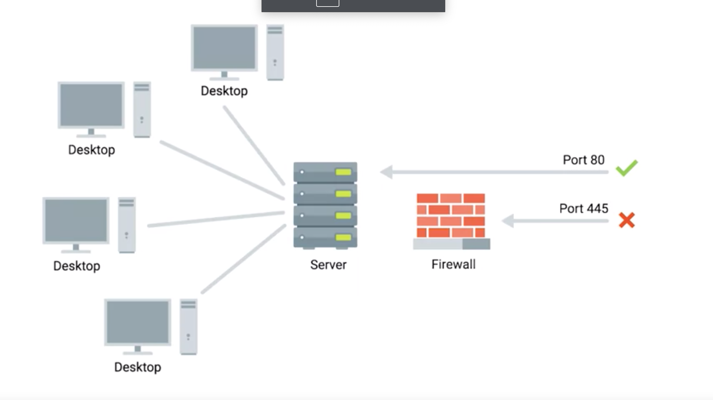
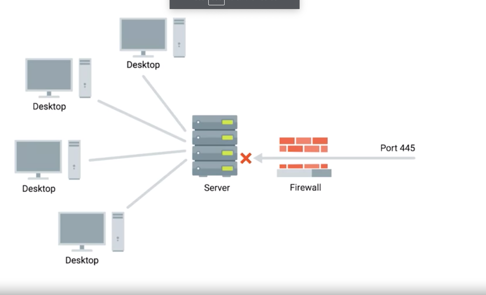

# Firewall

## Overview
* a device that blocks traffic that meets certain criteria.
* stop traffic you don't want from entering a network.

## Works on different layers of network
1. perform inspection of application layer traffic
2. deal with blocking ranges of IP addresses
3. Firewall most commonly used at the transport layer

## Firewalls at Transport Layer

* generally have a configuration that enables them to block traffic to certain ports while allowing traffic to other ports
* Example
  * a server a small company
    * two services
      1. service: server a public web page
        * http - port:80
      2. file server for a confidential internal document
        * FTP - port 21
  * Firewall
    * placed at the perimeter of the network (another device)
    * allow anyone (event external IPs) to send traffic to port 80
    * allow only internal IPs (network mask) to send traffic to port 21 to access confidential internal document
      * that is why you need VPN to access company's internal network

## Notes

* Firewall
  * can be a device
  * can be a software
* Operating System
  * have firewall functionality built-in
  * so you can configure the firewall of operating system of the server to block the traffic from specific port directly
