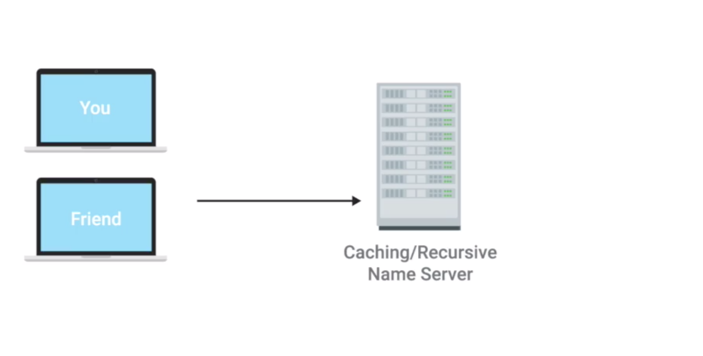
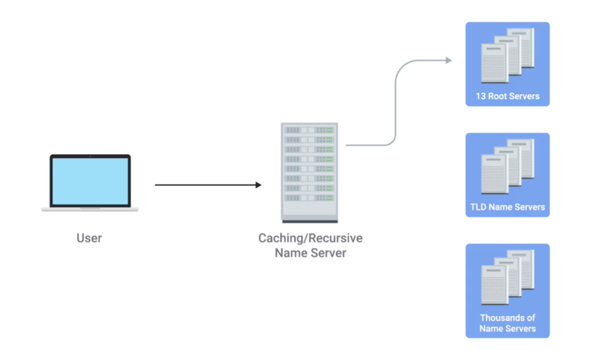
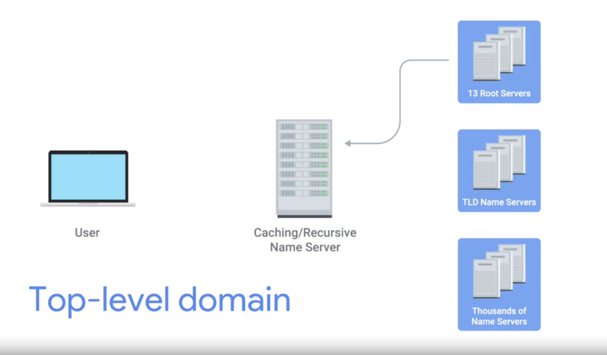
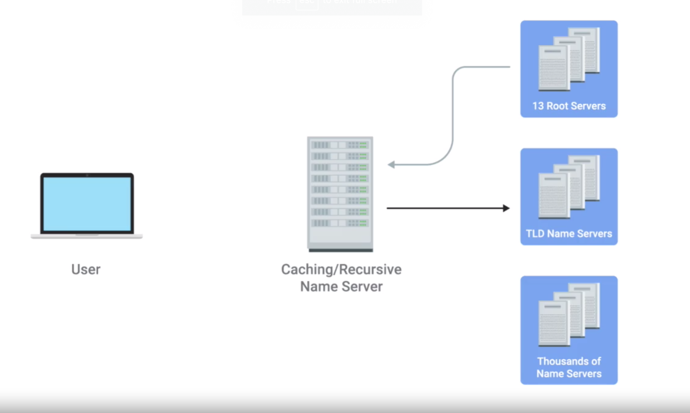
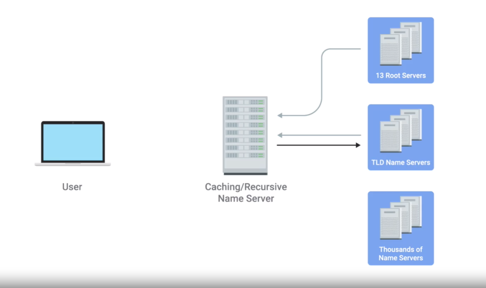
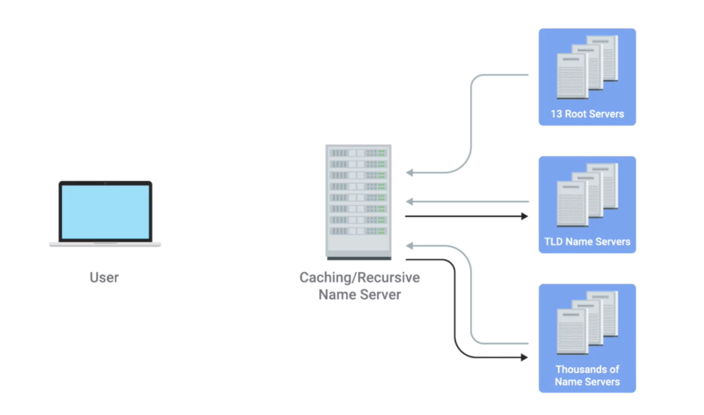
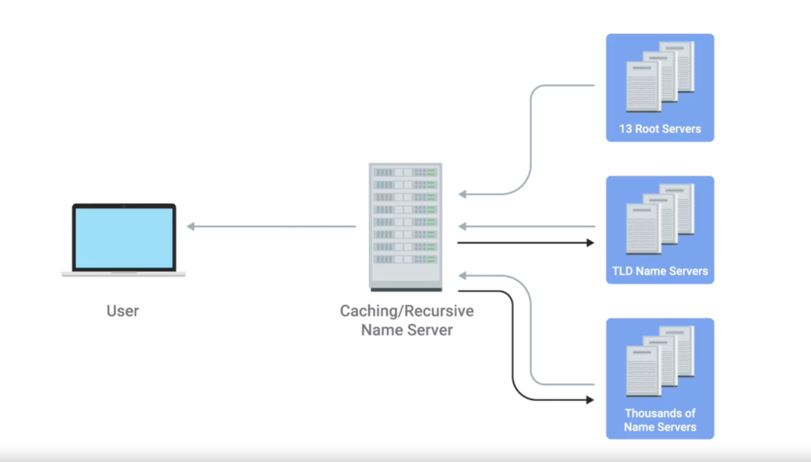

# Name Resolution

## Review
* DNS is a system that converts domain names into IP addresses.

## Overview
* Name Resolution
  * process of using DNS to turn a domain name into an IP address is known as name resolution

## How Name Resolution Works
* DNS servers, are one of the things that need to be specifically configured at a node on a network.
* For a computer to operate on a modern network, they need to have certain number of things configured.
  * what need to be configured
    1. IP Address
    2. subnet mask
    3. gateway
    4. DNS Server
  * sub-notes
    * network works fine without DNS Server but hard for human to recognize the website
    * MAC Addresses are hard coded in hardware so no need to be configured

## Five Primary Types of DNS Server
1. caching name servers
2. recursive name servers
3. root name servers
4. TLD name servers
5. authoritative name servers.

* any given DNS server can fulfill many of these roles at once

#### Caching Name Server
* are generally provided by an ISP or your local network
* Their purpose is to store domain name lookups for a certain amount of time. (cache name resolution related data)
  * there are lots of steps in order to perform a fully qualified resolution of a domain name
    1. TCP connections
    2. data transmission
* Most caching name servers are also recursive name servers
* In fact, your local computer from your phone to a desktop will generally have its own temporary DNS cache as well, that way, it doesn't have to bother its local name server for every TCP connection either

#### Recursive Name Server
* perform full recursive DNS resolution requests

##### Example for Caching Name Server
1. You and Your friend's computer are at same network space
  * both been configured with the same name server
2. Your friend enter www.facebook.com into the browser
3. name server now performs a **fully recursive resolution** to discover the correct IP for www.facebook.com
4. Name server send IP to your friend's computer and stored locally in a cache (name server)
5. A few minutes later you enter www.facebook.com into a web browser
6. the local name server still has the IP that it resolved (cached data) to stored and is able to deliver that back to your computer without having to perform a full lookup

 
 

 
 

##### Steps for full recursive resolution
1. Contact a root name server
  * root server
    * 13 total root name servers
      * they're responsible for directing queries toward the appropriate TLD (top-level-domain) name server.
2. The root servers will respond to a DNS (caching/recursive) lookup with the TLD name server that should be queried
3. The TLD name servers will respond again with a redirect
  * inform the computer performing the name lookup with what authoritative name server to contact.
4. Finally, the DNS lookup could be redirected at the authoritative server for weather.com which would finally provide the actual IP of the server in question

## Notes
* All domain names in the global DNS system have a TTL (Time TO Live)
  *  a value in seconds, that can be configured by the owner of a domain name for how long a name server is allowed to cache in entry before it should discard it and perform a full resolution again.
  * value in seconds
  * can be configured
  * determine hoe long a name server can maintain cache in entry
  * in olde time, the value is big/long (a day/several days)
    * Since bandwidth is small and tiny, the network administrators didn't want to waste bandwidth to constantly performing full DNS lookups
  * now a day, Internet has grown and gone faster
    * TTL can be small to minutes or few hours

* Root Name Server
  * In the past, these 13 root servers were distributed to very specific geographic regions,
  * but today, they're mostly distributed across the globe via anycast
* Anycast is a technique that's used to route traffic to different destinations depending on factors like location, congestion, or link health.
* Using anycast, a computer can send a datagram to a specific IP but could see it routed to one of many different actual destinations depending on a few factors. This should also make it clear that there aren't really only 13 physical route name servers anymore. It's better to think of them as 13 authorities that provide route name lookups as a service.

*  TLD
  * stands for top level domain and represents the top of the hierarchical DNS name resolution system
  * is the last part of any domain name
  * example
    * www.facebook.com
      * .com === TLD

* For each TLD in existence, there is a TLD name server, but just like with root servers, this doesn't mean there's only physically one server in question, it's most likely a global distribution of anycast accessible servers responsible for each TLD.

* Authoritative name servers
  * are responsible for the last two parts of any domain name which is the resolution at which a single organization may be responsible for DNS lookups
  * example
    * www.weather.com
      * .com === TLD
      * the TLD name server would point a lookup at the authoritative server for Weather.com, which would likely be controlled by the Weather Channel, the organization itself that runs the site

* Benefit of the strict hierarchy of Domain Name System
  * protect against malicious parties redirecting traffic
  * using a hierarchical system controlled by **trusted entities** in the way DNS does, we can better ensure that the responses to DNS lookups are accurate
    * your computer will not blindly get ip address from random malicious name server

## References
[anycast - cloudflare](https://www.cloudflare.com/learning/cdn/glossary/anycast-network/)
