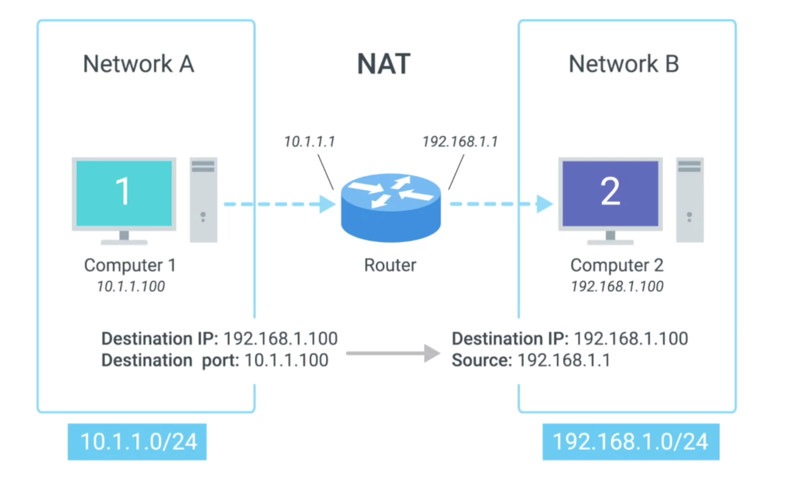

# Network Address Translation

## Preview
* is not like DHCP as a protocol, instead, NAT is a technique
* Different operating systems and different network hardware vendors have implemented the details of NAT in different ways

## Overview
* NAT take one IP address and translate it to another one
* why do this
  * security
  * preserve the limited amounts of available IPV4 space

## How NAT works **(in network layer)**
* IP masquerading
  * allow gateway(router, firewall) to rewrite the source IP of an outgoing IP datagram.
    * retain the original IP in order to rewrite it into the response
  * hide the IPs of local computers from other network.
  * benefit
    * no other computers will know IP address of your computer so no one can establish the connection with your computer actively
* one to many NAT
  * one === router, many === connected computers
  * Hundreds of computers on local network (networkA)
    * all of their IPs being translated by the router to its own interface IPs.
      * **hundreds even thousands of computers can all have their outbound traffic translated via NAT to a single IP**
  * To the outside world, the entire address space of networkA is protected and invisible

#### NAT Example

* players
  * Network Space A
    * address space: 10.1.1.0/24
    * computer 1
      * client
      * IP: 10.1.1.100
  * Network Space B
    * address space: 192.168.1.0/24
    * computer 2
      * server
      * IP: 192.168.1.100
  * Router
    * Interface A
      * 10.1.1.1
    * Interface B
      * 192.168.1.1

* IP datagram
  * source IP: 10.1.1.100
  * destination IP: 192.168.1.100

* old steps (without NAT)
  * computer-1 send packet to gateway(the router)
  * router
    * receive packet
    * exam destination IP address
    * check the checksum blablabla
    * check routing table
    * decrement the TTL
    * re-caculate the checksum
    * ...
    * forward the packet
* new steps (with NAT)
  * computer-1 send packet to gateway(the router)
  * router masquerades the source IP address
    * IP datagram
      * source IP: 192.168.1.1
      * destination IP: 192.168.1.100
  * When the datagram gets to computer two, it will look like it originated from the router not from computer one. Now computer two crafts its response and sends it back to the router. The router knowing that this traffic is actually intended for computer one, rewrites the destination IP field before forwarding it along
