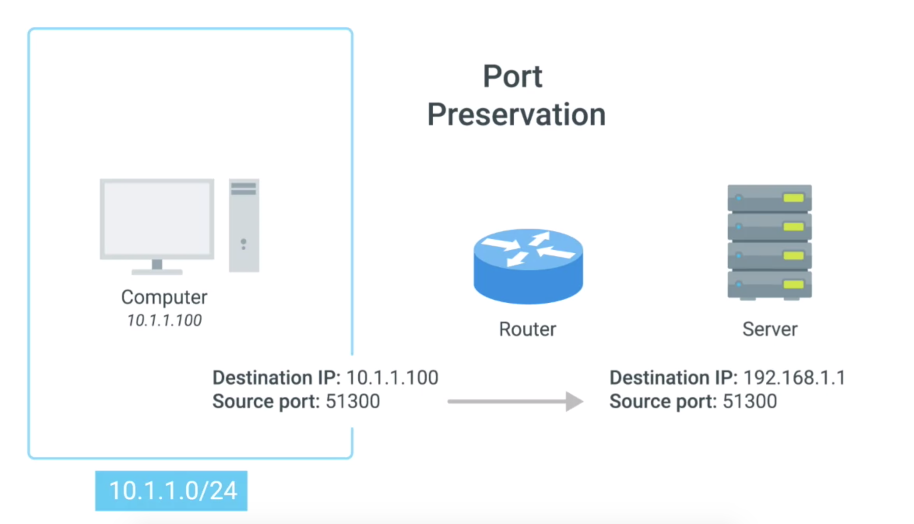
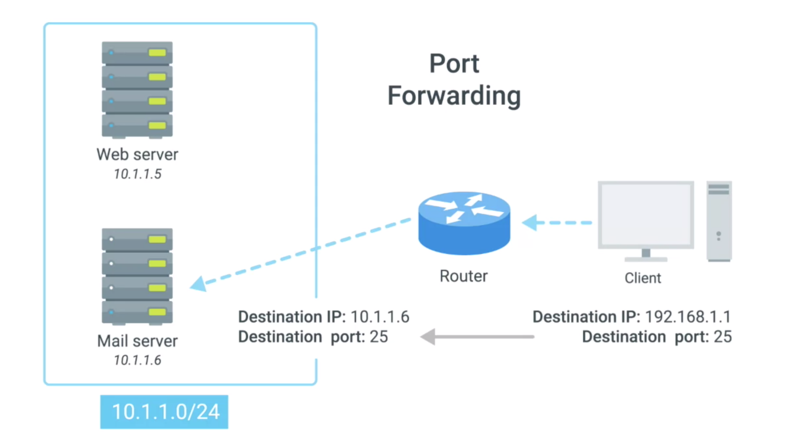

# NAT at Transport Layer

## Overview
* NAT at transport layer is more complicated than in Network Layer
  * need more techniques
* one to many
  * easy to understand when the traffic is outbound, but a little more complicated once return traffic is involved
  * router needs to figure out which responses go to which computer

## Port Preservation
* is a technique where the source port chosen by a client, is the same port used by the router
* outbound connections choose a source port at random, from the ephemeral ports
  * ephemeral ports
    * 49,152 - 65, 535.
* a router setup to NAT outbound traffic
  * keep track of what the source port is of outbound traffic and use that to direct traffic back to the right computer
  * the router will have an NAT map
    * map ephemeral port number to original IP address

* router performs network address translation and places its own IP in the source address field of the IP datagram, but it leaves the source port in the TCP datagram the same and stores this data internally in a table (NAT map). Now, when traffic returns to the router and port 51,300, it knows that this traffic needs to be forwarded back to the IP 10.1.1.100

* Problem
  * it's possible for two different computers on a network to both choose the same source port around the same time
  * solution: the router normally selects an unused port at random to use instead

## Port Forwarding
* is a technique where a specific destination ports can be configured to always be delivered to specific nodes
  * This technique allows for complete IP masquerading, while still having services that can respond to incoming traffic
* example
  * setup
    * server network space: `10.1.1.0 \24`
    * web server IP: `10.1.1.5`
      * With port forwarding, no one would even have to know this IP
  *  Prospective web clients would only have to know about the external IP of the router
    * external IP === interface of router to the server network space
      * IP === 192.168.1.1
      * Any traffic directed at port 80 on 192.168.1.1, would get automatically forwarded to 10.1.1.5.
* Response traffic would have the source IP rewritten to look like the external IP of the router

#### Multiple Services with Port Forwarding
  * This technique not only allows for IP masquerading, it also simplifies how external users might interact with lots of services all run by the same organization
  * example
    * Let's imagine a company with both a web server and mail server, both need to be accessible to the outside world but they run on different servers with different IPs. Again, let's say the web server has an IP of 10.1.1.5, and the mail server has an IP of 10.1.1.6. With port forwarding, traffic for either of these services could be aimed at the **same external IP and therefore the same DNS name**, but it would get delivered to entirely different internal servers due to their different destination ports

## References
[port preservation](https://notes.shichao.io/tcpv1/ch7/)
