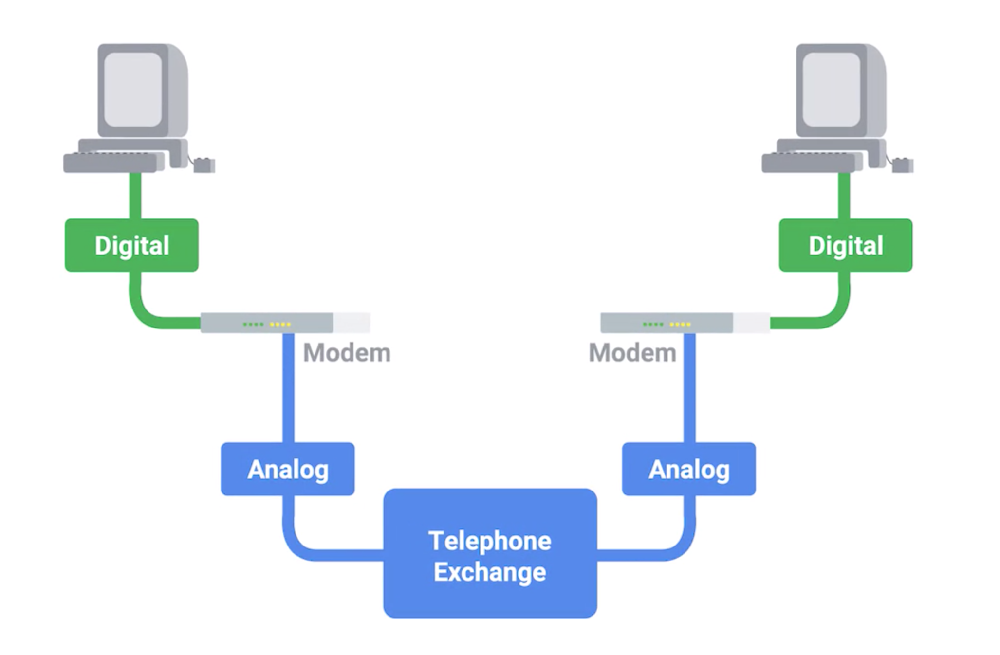

## In old time
* has no Ethernet, TCP or IP
* focus more on connecting devices within close physical proximity to each other

## The public Switched Telephone Network (PSTN)
* invented in 1970s
* === Plain Old Telephone Service or POTS
* connect computers at further distances
* use phone lines to transmit data
* the most prominent system: USNET

## Dial-up Connection
* use POTS for data transmission
* the connection is established by actually dialing a phone number
* Transferring data across a dial-up connection is done through **modems**.

#### Modem
* Modem stands for modulator and demodulator
* take data that computers can understand and turn them into audible wavelengths that can be transmitted over POTS
  * transfer digital signal from computer to analog signal for POTS transmission
  * DS to AS <- the telephone system was developed to transmit voice messages or sounds from one place to another
* early modems
  * had very low baud rate
  * baud rate
    * is a measurement of how many bits could be passed across a phone line in a second

#### History
* late 1950s
  * 110 bits per second through phone line
*  USENET was being developed, this rate had increased to around 300 bits per second.
* 1990s
  * dial-up access to the Internet became a household commodity
  * 14.4 kilobits per second.
* Improvements continue to be made, but widespread adoption of **broadband technologies** replaced a lot of these improvements
