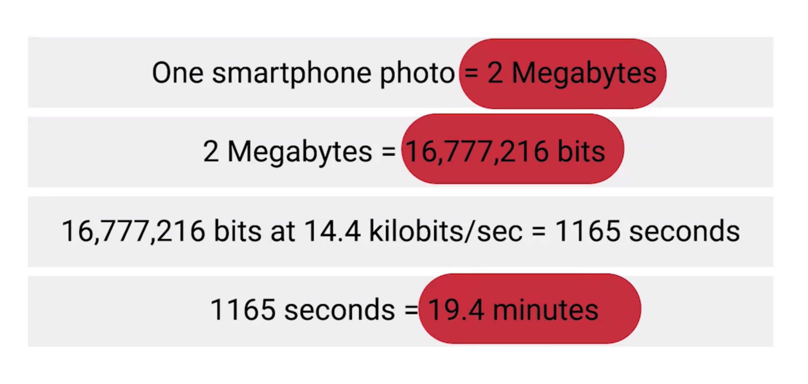

# What is Broadband

## Broadband
* refer to any connectivity technology that isn't dial-up Internet
* always much faster than even the fastest dial-up connections
* always on
  * long lasting connections that don't need to be established with each use

#### Technologies
* T-carrier technologies
* digital subscriber lines or DSL
* cable broadband
* fiber connections.

##### T-carrier Technology
* By the mid 1990's, it had become pretty common for businesses that needed internet access for their employees to use various T-carrier technologies.
* invented by AT&T in order to transmit multiple phone calls over a single link
* became common transmission systems to transfer data much faster than any dial-up connection could handle

##### Download a photo without Broadband technologies

## References
* [what is broadband - xfinity](https://www.xfinity.com/hub/internet/broadband)
