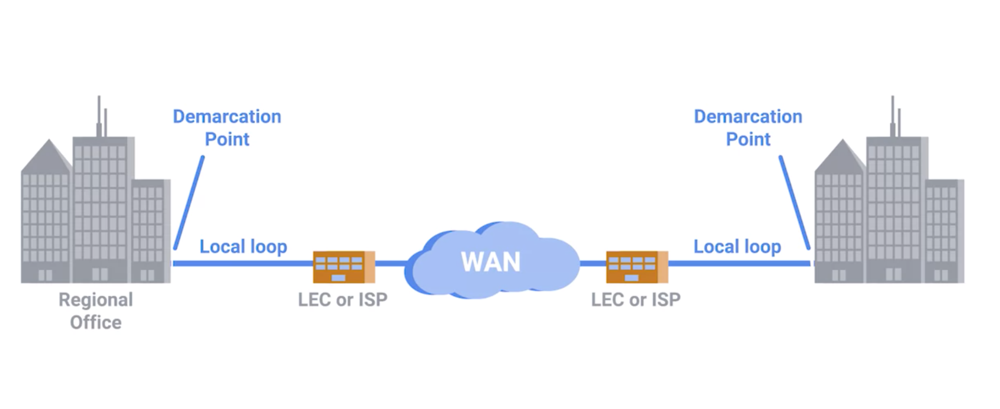

# Wide Area Network Technologies

## IT support specialist at a small company.
1. use non-routable address space for devices(internal IPs)
  * only few users
  *  IP addresses
    * scarce
    * expensive
2. set up router
  * NAT
3. configure local DNS Server
4. configure DHCP server
5. sign a contract with an ISP to deliver a link to the Internet to this office so your users can access the web
6. configure a VPN server
  * make sure the VPN server is accessible via port forwarding
  * employees at the field can access data in Local Area Network (LAN)

## IT support specialist in Global Organization
* you need Wide Area Network (WAN)
* multiple offices at different countries

## WAN
* wide area network
* A wide area network acts like a single network but spans across multiple physical locations
* sign a contract with ISP to get private WAN
  * ISP transmits your data through its own network
  * it could be like all of your computers(at different countries) are in the same physical location

#### WAN set up

* Building -> demarcation point -> local loop (t-carrier || fiber cable) -> local regional office(ISP) -> ISP'S core network (part of WAN) -> Internet (part of WAN) -> local regional office -> local loop -> demarcation point -> building

* transfer data by different protocols at data link layer
* In fact, these same protocols are what are sometimes at work at the core of the Internet itself instead of our more familiar Ethernet.

## LAN vs. WAN
#### LAN
* Benefits
  * higher speed
  * lower cost
  * easy to setup
* Downsides
  * limited to small area
    * restricted ethernet cable length or wi-fi signal range

#### WAN
* Benefits
  * Allow for much larger and more intricate network
  * Can cover near infinite geographical distance
* Downsides
  * higher cost
  * lower speed
  * difficult to setup
* scenario
  * house to house
  * city to city
* note
  * having private WAN is really expensive
  * access public website by public WAN
  * usually the route is set up by ISP or infrastructure company
    1. cable
    2. towers || satellites

## References
* [WAN vs. LAN](http://packetworks.net/lan-vs-wan-the-benefits-of-each-network-type/)
