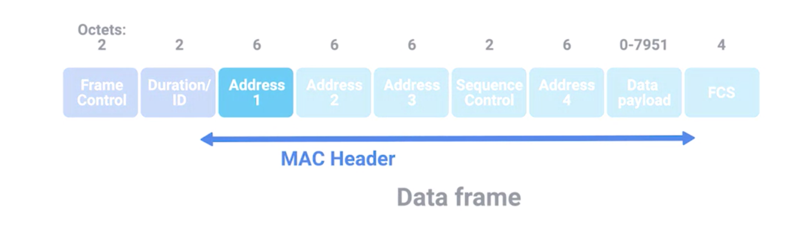

## Goal
* how wireless communication works
* difference between infrastructure networks, and ad hoc networks.
* how wireless channels help wireless networks operate
* wireless security protocol

## Frequency Band
* FM radio in North America
  * 88 and 108 megahertz
* WiFi
  * operate on a few different frequency bands. Most commonly, the 2.4 gigahertz and 5 gigahertz bands

## 802.11 Family

* IEEE 802.11 standards
  * make up the set of technologies we call WiFi
  * defines how wireless networking devices should communicate
  * defines how we operate at both the physical and the data link layers.

* Different 802.11 standards generally use the same basic protocol, but might operate at different frequency bands.
  * A frequency band is a certain section of the radio spectrum that's been agreed upon to be used for certain communications

* There are lots of 802.11 specifications
  * example (in order for more advanced)
    1. 802.11b
    2. 802.11a
    3. 802.11g
    4. 802.11n
    5. 802.11ac
    * improvement
      * higher access speeds
      * more devices to use the network simultaneously.

#### Fields
* Frame Control Field
  * 16 bits long
  * contains a number of sub-fields that are used to describe how the frame itself should be processed
  * This includes things like what version of the 802.11 was used
* duration field
  * It specifies how long the total frame is. So, the receiver knows how long it should expect to have to listen to the transmission
* four address fields
  * why there are four instead of the normal two
    * needs to be room to indicate which wireless access point should be processing the frame
    1. source address
      * MAC address of the sending device
    2. intended destination on the network
    3. receiving address
      * MAC address of the access point that should receive the frame
    4. transmitter address
      * MAC address of whatever has just transmitted the frame
  * In lots of situations, the destination and receiver address might be the same.
  * Usually, the source and transmitter addresses are also the same
  * Since all addresses in an 802.11 frame are Mac addresses, each of those four fields is 6 bytes long
* sequence control field
  * 16 bits long
  * contains a sequence number used to keep track of ordering the frames
* data payload
  *  has all of the data of the protocols further up the stack
* frame check sequence field
  * contains a checksum used for a cyclical redundancy check

#### Wireless Connection Setup
* access point
  * is a device that bridges the wireless and wired portions of a network.
  * A single wireless network might have lots of different access points to cover a large area
  * Devices on a wireless network will associate with a certain access point
    * physically closest to
    * general signal strength
    * wireless interference
  * device -> specific access point || specific access point -> device
