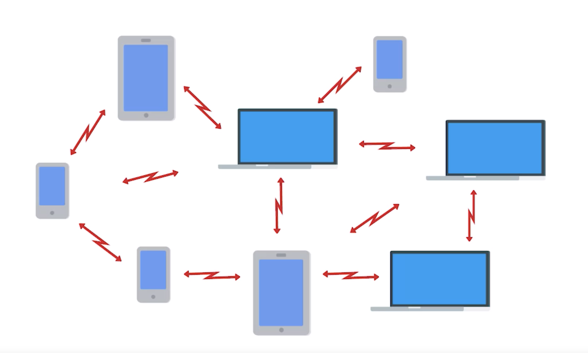
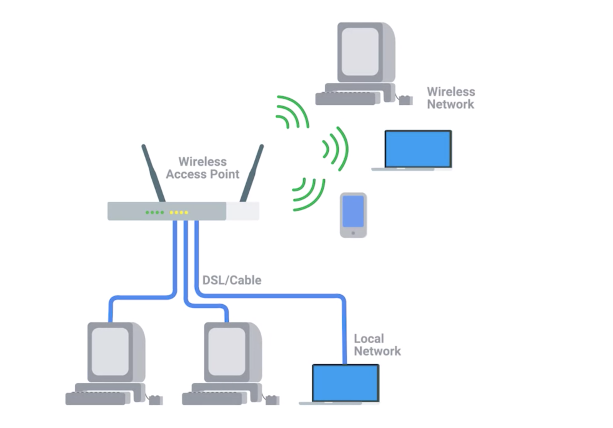
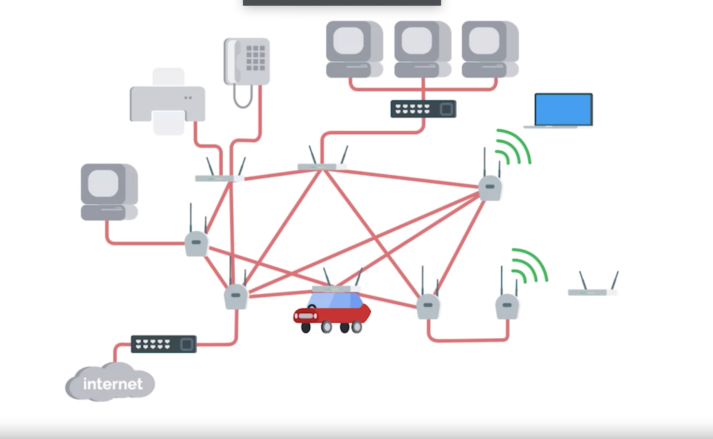

# Wireless Network Configuration

## Three main ways of configuration
1. Ad-hoc networks
  * nodes all speak directly to each other
2. WLANS || LANS
  * one or more access points act as a bridge between a wireless and a wired network
3. Mesh networks
  * hybrid of the previous two configurations

## Ad-hoc

* is the simplest one among the three configurations
* no supporting network infrastructure
* Every device involved with the network communicates with every other device within range, and all nodes help pass along messages
* aren't the most common type of wireless network
* good choice for wireless connection during emergency
  * no need network infrastructure
* example
  1. bluetooth
  2. air drop

## Wireless LAN (WLAN)
* The most common type of wireless network in the business world
* A wireless LAN consist of one or more access points which act as bridges between the wireless and wired networks
  * The wired network operates as a normal LAN
    * contains
      * the outbound internet link
        * In order to access resources outside of the WLAN, wireless devices would communicate with access points. They then forward traffic along to the Gateway router, where everything proceeds like normal

## Mesh networks
  * Mesh networks are kind of like ad-hoc networks, since lots of the devices communicate with each other wirelessly forming a mesh if you were to draw lines for all the links between all the nodes
  * Most Mesh networks you'll run into are made up of only wireless access points, and will still be connected to a wired network. This kind of network lets you deploy more access points to the Mesh without having to run a cable to each of them. With this kind of setup, you can really increase the performance and range of a wireless network.

