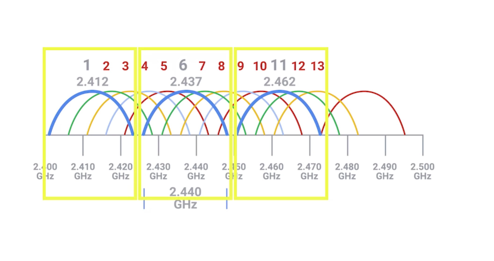

# Channels

## Overview
* Channels are individual, smaller sections of the overall frequency band used by a wireless network.
  * prevent collision domain
    * collision domain is any one network segment where one computer can interrupt another
      * Communications that overlap each other can't be properly understood by the receiving end. So when two or more transmissions occur at the same time, also called a collision, all devices in question have to stop their transmissions
* In wired connection
  * switch solve the problem of collision domain
    * Switches remember which computers live on which physical interfaces. So traffic is only sent to the node It's intended for.

* In wireless connection
    * channel works just like switch through different frequencies
    * In 802.11b network
      * For example, dealing with an 802.11b network, channel one operates at 2412 megahertz, but since the channel width is 22 megahertz, the signal really lives on the frequencies between 2401 megahertz and 2423 megahertz. This is because radio waves are imprecise things. So, you need some buffer around what exact frequencies a transmission might actually arrive on.

## Channels Range
* channel is a range
  * has bandwidth
  * 802.11 in US
    1. 2.4 Gigahertz
      * range from 2.5 - 2.5
    2. 5 Gigahertz
  * Since different countries and regions have different regulatory committees for what radio frequencies might be used for what, exactly how many channels are available for use depends on where in the world you are

* 2.5 Gigahertz in US
  * has multiple channels
  * bandwidth === 22 megahertz
  * channel one operates at 2412 megahertz
    * 2401 - 2423

## References
* https://www.lifewire.com/wifi-channel-number-change-to-avoid-interference-818208
