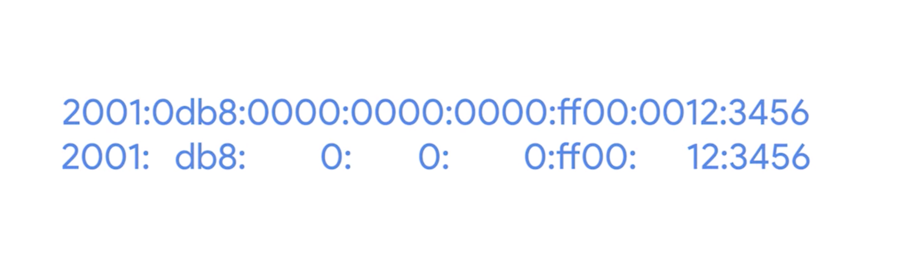
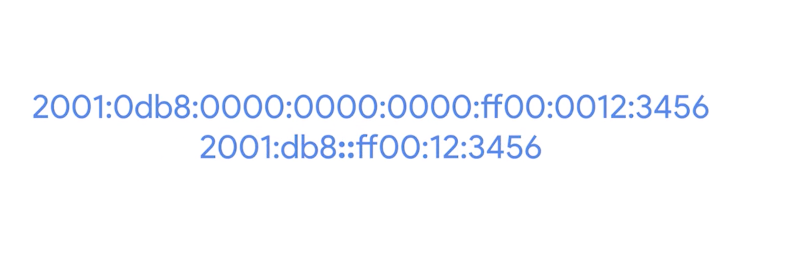

# IPv6

## overview
* IPv4 is running out
  * 32 bits
  * 4.2 billion individual addresses
  * four octets of decimal numbers j
* IPv5
  * was an experimental protocol that introduced the concept of connections
  * has no wide adoption
  * connection state was handled better later on by the transport layer and TCP

## IPv6 Overview
* 128 bits
* 2^128 -> 39-digit-long number.
  * undecillion
  * ginormous range
    * Some guesses on the total number of atoms that make up the entire planet Earth and every single thing on it get into that number range.
* written in 8 groups of 16 bits each
  * Each one of these groups is further made up of four hexadecimal numbers.
  * example
    * `2001:0db8:0000:0000:000:ff00:0012:3456`
* The IPv6 address space is so huge, there was never any need to think about splitting it up into address classes like we use to do with IPv4
* The first 64 bits of any IPv6 address is the network ID, and the second 64 bits of any IPv6 address is the host ID.
  * This means that any given IPv6 network has space for over 9 quintillion hosts.
  * IPv6 subnetting uses the same CIDR notation
    * This is used to define a subnet mask against the network ID portion of an IPv6 address.

## Special Notation Method
* `2001:0db8:0000:0000:000:ff00:0012:3456`
* rules
  1. remove any leading zeros from a group
  2. any number of consecutive groups composed of just zeros can be replaced with two colons (this can only happen once for any specific address)
    * 2b06:0000:0000:1f2b:d77f:0000:0000:89ce
      * 2b06::1f2b:d77f:0:0:89ce
    * 558c:0000:0000:d367:7c8e:1216:0000:66be
      * 558c::d367:7c8e:1216:0:66be
* example
  * after rule one
  
  * after rule two
  

## loopback address
* IPv4: 127.0.0.1
* IPv6: 31 0s with a 1 at the end
  * 0000:0000:0000:0000:0000:0000:0000:0001
    1. 0:0:0:0:0:0:0:1
    2. ::1

## Reserved Address
* starting at 2001:0db8 has been reserved for documentation and education
* any address that begins with FF00:: is used for multicast, which is a way of addressing groups of hosts all at once.
* ::1 for loopback
*  FE80:: are used for link-local unicast
  * allow for local network segment communications and are configured based upon a host's MAC address
  * The link-local address are used by an IPv6 host to receive their network configuration, which is a lot like how DHCP works
    * The host's MAC address is run through an algorithm to turn it from a 48-bit number into a unique 64-bit number. It's then inserted into the address's host ID.
