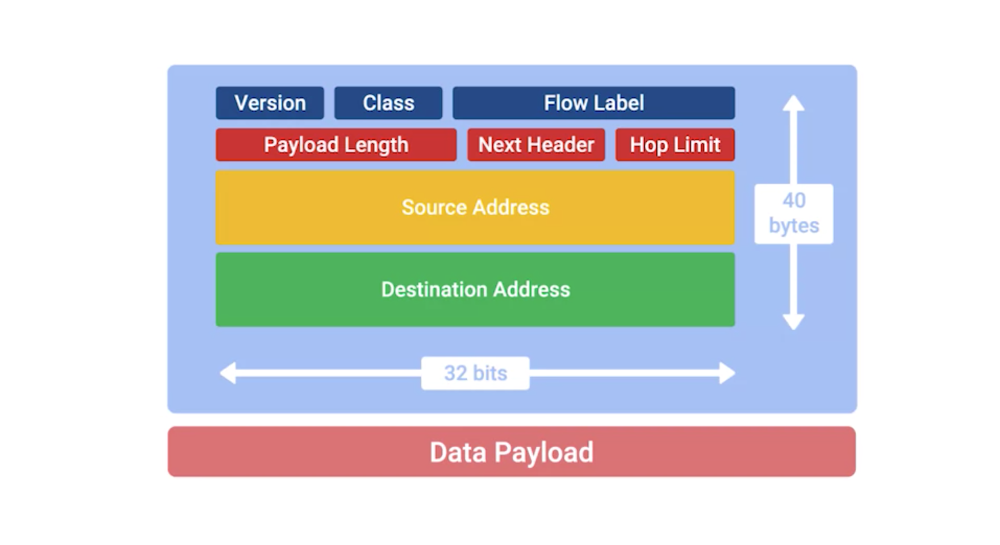

## Headers
* version
  * 4 bits
  * version of IP

* traffic class
  * 8 bits
  * defines the type of traffic contained within the IP datagram and allows for different classes of traffic to receive different priorities.

* flow label field
  * 20-bits
  * used in conjunction with the traffic class field for routers to make decisions about the quality of service level for a specific datagram

* payload length field
  * 16-bit field that defines how long the data payload section of the datagram is

* next header field
  * only exist in IPv6
  * IPv6 addresses are four times as long as IPv4 addresses. That means they have more ones and zeros, which means that they take longer to transmit across a link. To help reduce the problems with additional data that IPv6 addresses impose on the network, the IPv6 header was built to be as short as possible. One way to do that is to take all of the optional fields and abstract them away from the IPv6 header itself. The next header field defines what kind of header is immediately after this current one. These additional headers are optional, so they're not required for a complete IPv6 datagram. Each of these additional optional headers contain a next header field and allow for a chain of headers to be formed if there's a lot of optional configuration.

* hop limit
  * 8-bit field that's identical in purpose to the TTL field in an IPv4 header

* source and destination address fields, which are each a 128 bits

* If the next header field specified another header, it would follow at this time. If not, a data payload the same length as specified in the payload length field would follow.

## To Do
* need to read it again online
