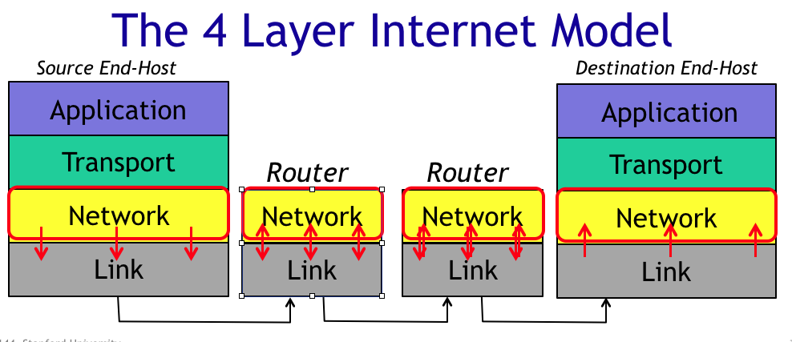
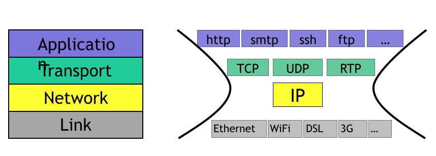
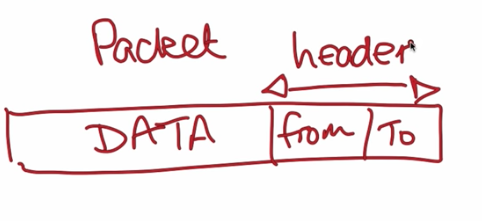
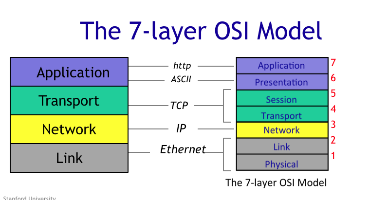

## Four Layer Internet Model
* Top to Bottom
1. Application
2. Transport
3. Network
4. Link

* Each layers do not care about how other layers work.
* Each layer has well defined API to communicate the layer beneath them.

### Link
* __Delivers data over a single link between an end host
and router, or between routers__
* Carry data over one link at a time.
* Different Link Layers Example: (has order)
 1. WiFi
 2. Ethernet
* Provide a service to the network layer.
* Transmit datagram from network layer to one link.

### Network
* __Delivers datagrams end-to-end. Best-effort delivery
– no guarantees. Must use the Internet Protocol (IP).__
* Deliver packets end-to-end across the internet from the source to the destination.
* Hands datagram to Link Layer.
* Dose not care how link layer transmit data, say, over WiFi or Ethernet, which means network layers has common way to communicate different link layers. (Separation Concern)
 * modularity of each layer and a common well-defined API to the layer below.

### IP (Internet Protocol)
 * IP makes a best-effort attempt to deliver our datagrams to the other end. But it makes no promises.
 * IP datagrams can get lost, can be delivered out of order, and can be corrupted. There are no guarantess.
 * If you need
  1. guarantee retransmit.
  2. delivered in order.
  -> then you need Transport layer
 * if we want to use internet we have to use internet protocol.

### Transport Layer
* __Guarantees correct, in-order delivery of data end-to-end. Controls congestion.__
* Most Common Transport layer is (TCP === Transmission Control Protocol)
* Make sure data is correctly delivered in right order.
  * if neywork layer drop some data, TL will make sure network layer retransmit.
  * Layer delivers them out of order – perhaps because two packets follow a different path
to their destination – TCP will put the data back into the right order again.
* Some application may not need TCP
 * Video Conference may just ignore network layer dropping some datagrams. Then the application just use other TL such as UDP === User Datagram Protocol
* UDP has no deliver guarantee.

### Application
* Only communicate application layer of another end-host. (Skype, BitTorrent)
* Send datagram down to the transport layer.
* __Bi-directional reliable byte stream between two applications, using application-specific semantics__

## Internet Comprise With
1. End-Host
2. Links
3. Routers

## Note
* whole file is separated to several small packets.
* packets
 * has header which describes where it should go and where dose it come from.

### How Data Pass
1. Source end-host
 a. pass data to link layer
 b. link layer pass data to link layer of router(node)
2. Router
 c. link layer of router pass data to network layer of this.
 d. network layer exam the destination of packets(datagram) and route the datagram one hop at a time to its destination.
 e. pass data back to link layer
 f. send it to different router.
 g. repeat b - g.
3. Destination end-host

## OSI (Open Systems Interconnection) Model
* ISO (International Standards Organization) create 7-layer OSI
* It has been replaced by 4 layer model

