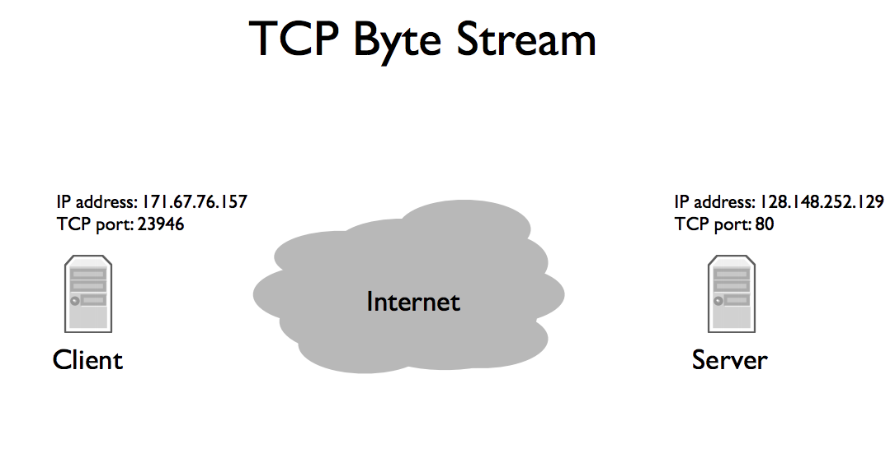
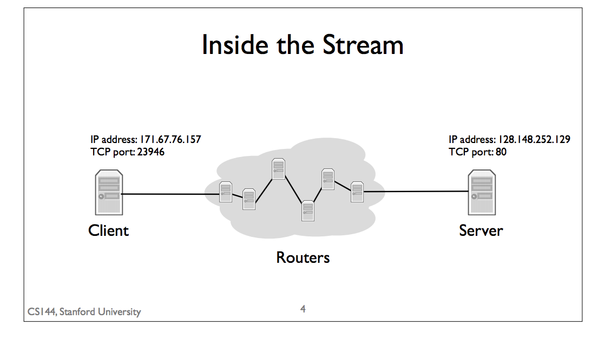
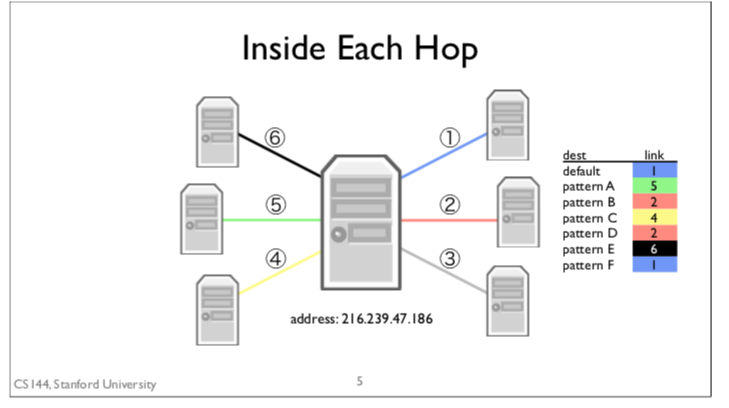

## Overview of Data Stream
1. application layer create stream of data and pass it to Transport layer.
2. transport layer break stream into segments of data, and pass it reliably to Network Layer.
3. Network layer transfer segments of data to packet and send it to another computer.

* Network layer: delivers packets to computers (end-host).
* Transport Layer: deliver data to applications
* Application Layer: transfer data to user.  (dataParser)

## TCP (Transport Control Protocol)
* Client sends connection request to server.
* Server listen for a connection request.
* Client and Server exchange message to build the connection, which call Three way handshake.
  1. First Step: client sends Synchronize Message (SYN)
  2. Second Step: server responds Synchronize and Acknowledge Message (SYN-ACK)
  3. Third Step: client responds by acknowledging the server's SYN-ACK, which called (ACK).

* From the perspective of Network layer, packets sent to different applications on the same computer look the same,
  so TCP need two addresses to differentiate them.

## TCP Byte Stream
* Internet Protocol Address: the address for network layer to deliver packets to the computer.
* TCP port: tells the computer's software which application to deliver data to.
  * Example: Web Servers usually run on TCP port 80.

* Network layer pass IP packets to Link Layer and pass it hop by hop to sever.
 * The destination address of IP packets is server's IP address.
 * IP packets has TCP segments whose destination port is 80.

* The Internet actually is consist of multiple routers, the packet is delivered hop by hop through different routers.
 * For example, since my client is on a WiFi network, the
 first hop is wireless to the WiFi access point. The access point has a wired connection to the
 broader Internet, so it forwards my client’s packets along this wired hop.

 
 

## Router
* Router can have multiple links
* Router itself has IP address.
* Router will exam each packet to check destination address to decide should it send to specific Router all pass it to it's own software.
  * Router pass packet to it's software Example: when you log into a router using TCP,
  the IP packets are destined to the router’s own IP address.

### Hop by Hop (How to decide)
1. Router receive packets
2. check the Forwarding Table
 * Forwarding Table consists of a set of IP address patterns and the link to send across for each pattern.
3. Find the specific matched entry's pattern and send packet to entry's link.
4. If the router can not find any matched pattern, it will just send the packet to default link.
 * For example, you’re Stanford University and have a router connecting you to the larger Internet. Your router will have many specific routes for the IP addresses of Stanford’s network: “send packets to the engineering school over this link”, “send packets to the library over that link.” But if the destination IP address isn’t Stanford’s, then the router should send it out to the larger Internet.

## Network Layer Example
* tool Wireshark
  * Filter: tcp.port ==80 && ip.addr == 128.148.32.12
  * Testing web: http://cs.brown.edu/
  * To see how end hosts exchange packets at the network layer
1. Three way handshake.
2. make connection
3. send Get request
4. receive response

* tool: command$: traceroute
 * How does it looks like inside the Network layer (how the Link Layer works)
 * traceroute -w 1 www.cs.brown.edu
 * After oshean.org that we see three stars -- this means there’s a router that won’t tell traceroute about itself. The stars are traceroute’s way to show it waited for a reply but the replied timed out. On hop 20 we see a router in Brown’s CS department. After that, everything is hidden -- Brown’s CS department doesn’t want you to be able to see what the inside of its network looks like.

## Conclusion
We’ve now seen the life of a packet, starting as an application-level client web request and taking nearly 20 hops through the Internet to reach its destination.
