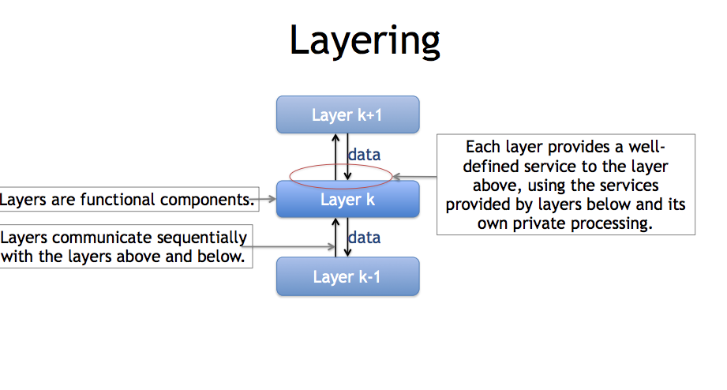
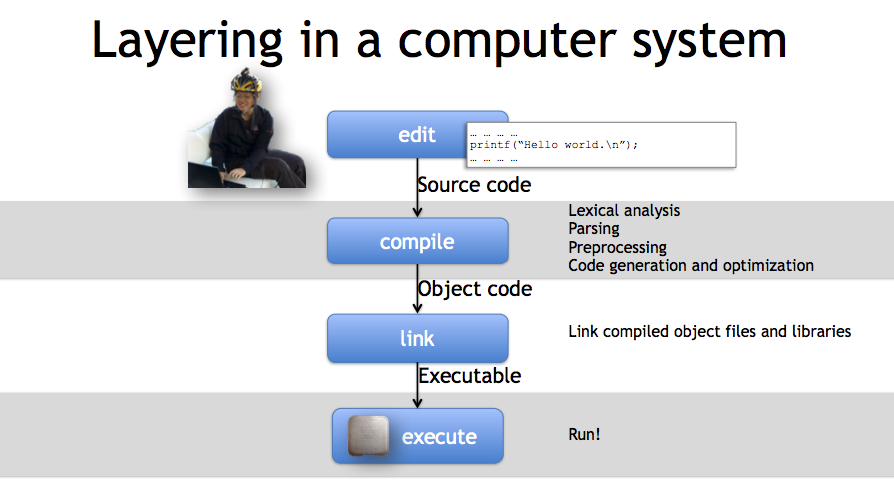
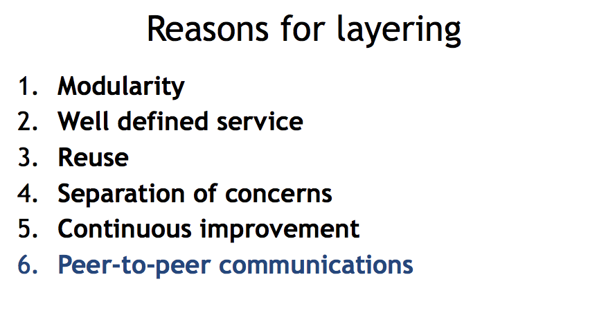

## Layering
* definition: is the name we give to organization of a system into a number of separate functional components.
* Hierarchical and each layer communicate sequentially.
* Each layer only interact to the layer directly above or below.
* Each layer provides well defined service to the layer above and using the services provided by the layers below and its own private processing.

### Example (Air line)
1. Conumer surf on Hipmunk kayak, google flights, expedia internet to find the flight
2. Air line provide flight schedule and send data to those website.
3. Meal provider provide meal to Air line...

### Example (Postal Service)
1. We can improve each layer independently
2. If I want faster, guaranteed delivery, I could hand the envelope to a carrier such as DHL or Fedex. The interface is almost the same – I give them an envelope and money
3.

### Example (Computer System)
* Each layer is self-contained functional component that is responsible for several tasks.
* Each layer only focus on itself's task.
* Each can be improved updated and replaced over time as technology and know-how progress.
  * Example: we can change commercial C compiler with gcc or vice-versa without needing to change the linker or the language we use.

#### Break Layering
* Example (C Language)
  Generally speaking, a piece of C code can be compiled for almost any processor. We can take C code like i++ and compile it for an ARM processor in a phone, an x86_64 processor in a laptop, or microcontroller in an ultra-modern dish washer..

But sometimes we need our C code to do something special that only our processor can do. For
example, an x86_64 processor has all kinds of special instructions that a microcontroller
doesn’t. C allows you to directly include assembly code. Software like operating systems
kernels such as Linux and Windows use this for some of their lowest level implementations.
The layering that C provides hides this detail so doesn’t let you do so directly, but you
have to do it to achieve your goal. So OS kernels include assembly code. Doing this
means that code is no longer layer independent: the Linux context switch assembly written
for ARM only works for ARM. So you have to write a version for each layer. If Linux wants
to run on a new processor, developers need to write new assembly code for that processor.
So this is a great example because it shows the benefits of layers they separate concerns
and simplify your system, just as programming C is easier than assembly. But sometimes you
have to break the layer boundaries. Doing so has a huge cost, suddenly you are no longer
independent of the lower layer, greatly limiting flexibility. So sometimes you have to do it,
but do so only when you really have to. As we’ll see, a lot of the practical, operational

