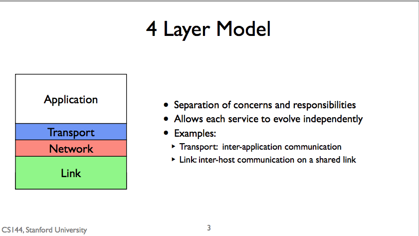
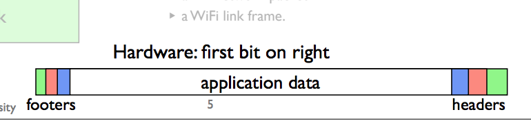
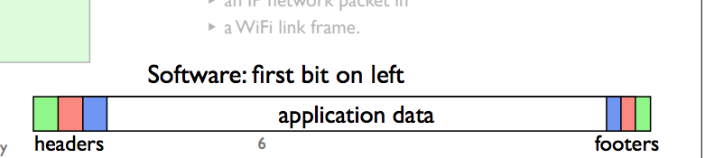
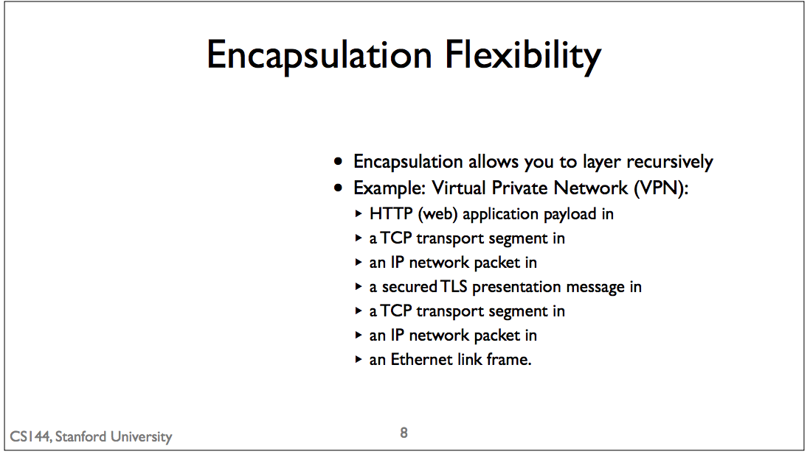
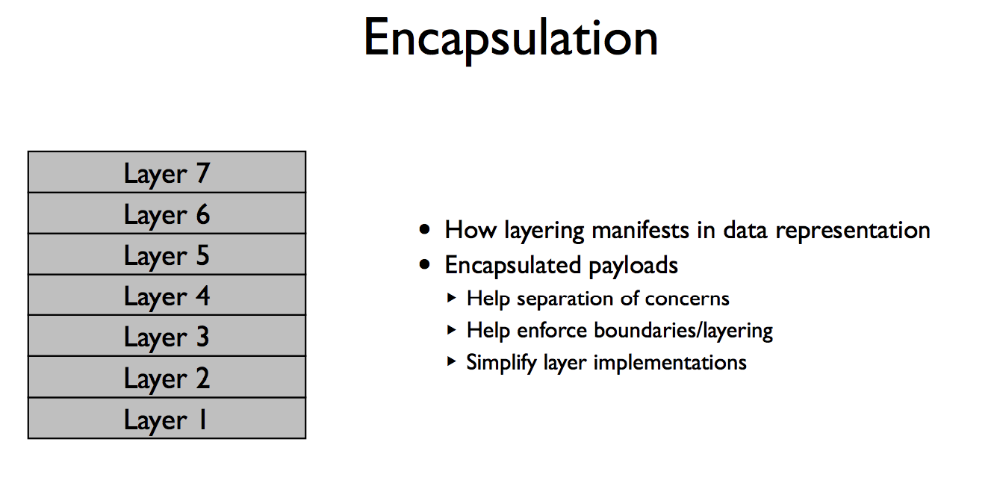

## Encapsulation
* result of layers + packet switching
* Examples:
   Ethernet Frame -> IP Packet -> TCP Segment.
* The principle that you organize informaiton in packets but the data still maintain layer system.

## 4 Layer Model Recap

## Encapsulation Example
1. Generate HTTP GET request which is the payload of a TCP segment
2. TCP segment which encapsulate the HTTP GET is the payload of an IP packet
3. This IP packet, encapsulating the TCP segment and the HTTP GET, is the payload of a WiFi frame.

* There are different ways to draw it. It depends on what type of system you are drawing for.

## Encapsulation Felxibility

* You can use encapsulation to recusively layer protocols
* Example Virtual Private Network (VPN)
  * With a Virtual Private Network, you open a secure connection to a network you trust, such as your office, for example using Transport Layer Security(TLS protocol).
  * A gateway for the private network, which will only accepts connections form permitted VPN clients and forwards their traffic into the private network.
  * the service that lets people log into the protected network over the virtual private network.

* TLS stream will be terminated at the virtual private network gateway

## Conclusion

