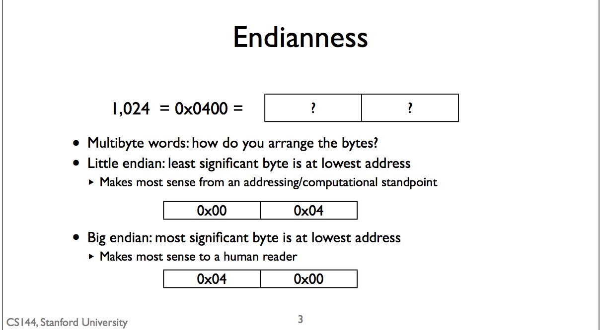

## Byte Order and Packet Formats
* For two parties to communicate.

## Byte Order
* Endianness
 * Little Endian (Least Significant Byte) (LSB)
  * the least significant byte is at the lowest address
  * The least significant byte comes first in memory
  *  a computational and architectural standpoint
 * Big Endian (Most Significant Byte) (MSB)
  *  most significant byte is the lowest address
  * For human point of view

## Network Byte Order
* Different processors have different endianness
 * Little endian: x86 (Intel, AMD)
 * Big endian: ARM
* To interoperate, they need to agree how to represent multi-byte fields
* Network byte order is big endian

## Portable Code
* Convert network order to host order.

## Packet Formats
* Internet specifications are written in plain ASCII text
* 4 bytes wide
* IPv4 has 5 rows of required fields.
 * means the IPv4 header is at least 20 bytes long.
* The total length field of an IPV4 packet is 2 bytes -> 16 bits long
  * IPv4 can't be longer than 65,535 bits. (2^16)
  * In big endian
  * Example
    * A packet of length 1400 bits -> 0x0578
    * The third byte of an IP packet of that length is 0x05.
* 0x -> hexadecimal

* Example: use Wireshark to monitor TLS protocol (TLS V1.2 )
 * 443 is standard TLS port
 * check the total length of IPv4 header
  * click it to see the corresponded hexadecimal data in the data segment.
  * 587 -> 0x024b in big endian

## Quiz
* The layout of a character string in memory is the same on big-endian and little-endian architectures -> true.
 * Endianness defines the order of bytes within multi-byte values. Character strings are arrays of single-byte values. So each value (character in the string) is the same on both little-endian and big-endian architectures, and endianness does not affect the order of values in a structure.
