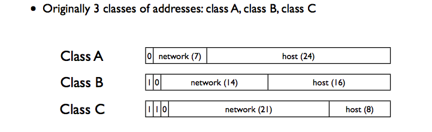

## Name and Address
* Goal of Internet Protocol Address
 * take different networks and stitch them together.
 * refer to a computer that was independent and unique of the network it was on.

## Internet Protocol Version 4
* IPv4 address
 * identify a device on the internet
 * Layer 3/ Network layer address
 * 32 bis long (4 octets)
  * 128.30.76.82
 * The IP / Network layer delivers packets whose destination is this address to that device.

* Netmask
  * tells the device which IP addresses are local -- on the same link -- and which require going through an IP router.
  * apply this mask, if it matches, in the same network
  * Example:
    * Netmask of 255.255.255.0 means if the first 24 bits match
      * ( means the first 3 octets are all 1s (2 to the 8th -1 is 255) )
      * 11111111.11111111.11111111.00000000
    * Netmask of 255.255.252.0 means if the first 22 bits match
    * Netmask of 255.128.0.0 means if the first 9 bits match
    * Smaller netmask (fewer 1s) means larger network
  * How to:
    * Netmask && 129.128.33.22 === Netmask && 129.128.22.11 then two computers are in the same network.
  * if two computers are in same ethernet they can communicate each other directly without router.

## Address Structure in Old Time
* network + host
 * Network: administrative domain (Stanford University, MIT, BBN, etc.)
 * Host: get to correct device in network (within administrative domain)

* Three classes
  * ClassA
   * Leading Bit: 0
   * Network: 7 bits (128 networks)
   * Host: 24 bits (16 million computers)
  * ClassB
    * Leading Bit: 10
    * Network: 14 bits
    * Host: 16 bits (65,536 computers)
  * ClassC
    * Leading Bit: 110
    * Network: 21 bits
    * Host: 8 bits (256 computers)

* Example:
  * Stanford University has Class A address block
  * Each dorm has class b address blocks

## Address Structure Today (CIDR)
### Classless Inter-Domain Routing (CIDR)
 * Rather than have prefixes only of length 8, 16, and 24 bits, CIDR allows prefixes to be any number of bits.
 * /14: mean a netmask of length 16. -> has 2^18 different IP address
 * Address block is a pair: address,count
 * Counts are powers of 2, specify netmask length
 * 171.64.0.0/16 means any address in the range 171.64.0.0 to 171.64.255.255
 * A /24 describes 256 addresses, a /20 describes 4,096 addresses

## IPv4 Address Assignment
* Internet Corporation for Assignment of Names and Numbers (ICANN)
 * delegate the work to IANA.
* Internet Assigned Numbers Authority (IANA)
 * Gives out /8s (16 millions addresses) to Regional Internet Registries (RIRs)
* Regional Internet Registries
 * Each continent has its own RIR
  * America: ARIN
  * Western Pacific (APNIC)
 * Each RIR has its own policy on how to break up the /8s into smaller blocks of address for different parties. 
