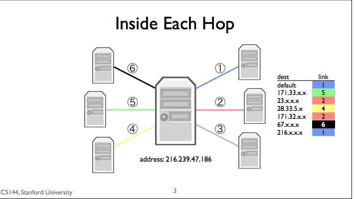
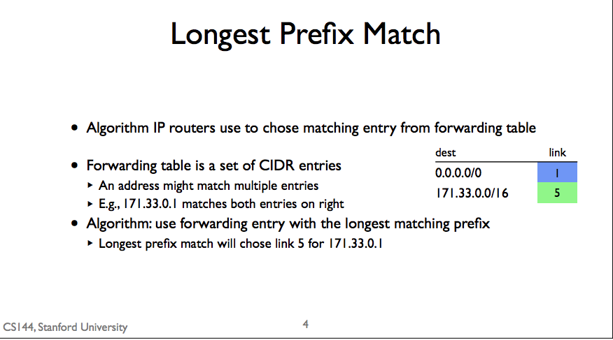
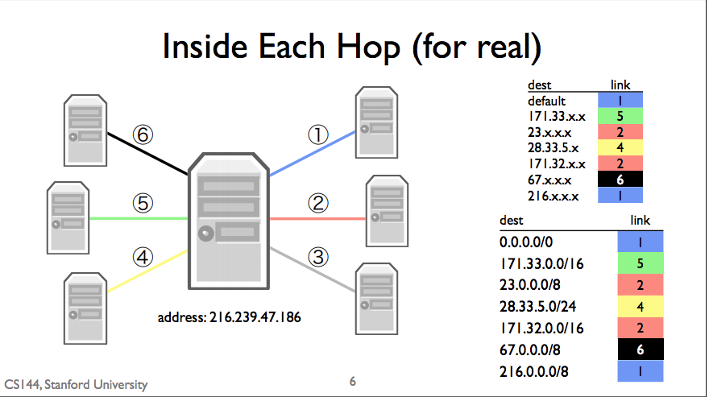

## Longest Prefix Match
* Router use Algorithm: longest prefix match to select which link to forward the packet.

## How Forwarding Table Work
* 216.xxxx
  * x stands for wildcard.
* Router match packet destination address with forwarding table. To find the specific matched link.
* The default route is effectively all wildcards

## CIDR Forwarding Table
1. A CIDR entry describing a block of addresses.
2. Next hop for packets that match CIDR entry

## Note
* destination address has to be exactly match to CIDT entry ip address. Otherwise it will just sent to default link.
