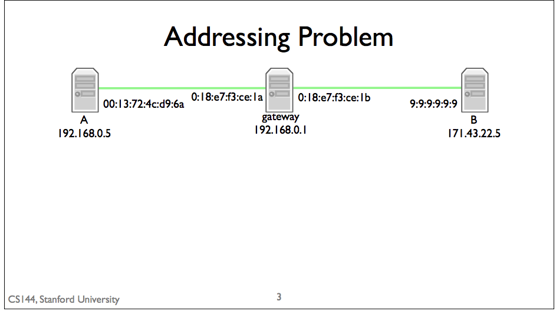
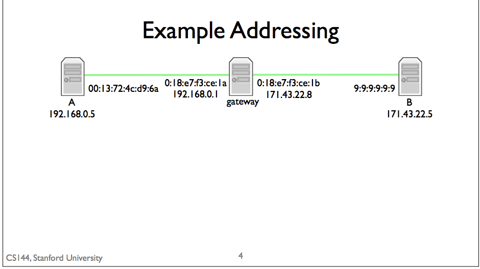
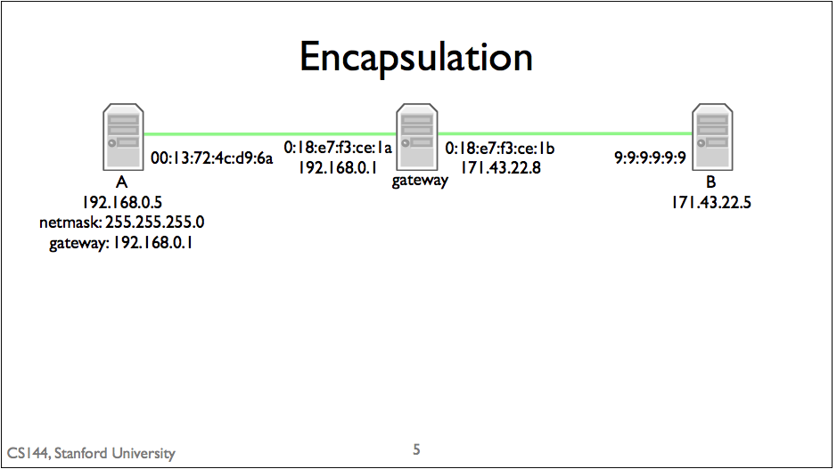

## Address Resolution Protocol
* I(Network Layer) have an IP packet whose next hop is this address  -- what link address (Link Layer) should I send it to?

## Layers of Address
* Network Layer
  - IP address: describe a host a unique destination
    * example: 171.67.76.65
* Link Layer
  - describe a particular network card
  * network card
    * sends and receives link layer frames
    * Example
      * Ethernet Card
        * has 48 bit unique Ethernet address
        * 00:13:72:4c:d9:6a

## Addressing problem

* if the gateway has one ip address but two network card
  *  192.168.0.1 and 171.43.22.5 in same network -> netmask: 128.0.0.0,
  * all ip address start at 1 will be in the same network -> wrong!!!

* gateway
  * is a node
  * the edge of the network
  * data flow through into it and out form it.
  * example: router

## Example Addressing

* a gate way has multiple interface
  * each interface has their own ip address and network card
  * good for permit specific computer to has connection.
   * example: you can set your router to only accept your computer's MAC address

## Send Packet (Process of Link/Network Layer's Address)

* Send packet from A to B
  1. Packet
    * check if destination IP(Network Layer's address) address is in the same network
      * source ip; 192.168.0.5
      * netmask: 225.225.225.0
      * destiantion IP: 171.43.22.5
      * result: not in same network
    * send packet to gateway
  2. Packet status
    * source IP:  192.168.0.5
    * destination IP: 171.43.22.5
    * link layer source address: 00:13:72:4c:d9:6a
    * link layer destination address: 0:18:e7:f3:ce:1a
    * result arrive gateway leftside interface and gateway send it to right side interface
 3. packet status
   * source IP:  192.168.0.5
   * destination IP: 171.43.22.5
   * link layer source address: 00:13:72:4c:d9:6a
   * link layer destination address: 0:18:e7:f3:ce:1b
   * arrive right side interface gateway send it to node B
 4.
   * source IP:  192.168.0.5
   * destination IP: 171.43.22.5
   * link layer source address: 00:13:72:4c:d9:6a
   * link layer destination address: 9:9:9:9:9:9
   * to node B
*
