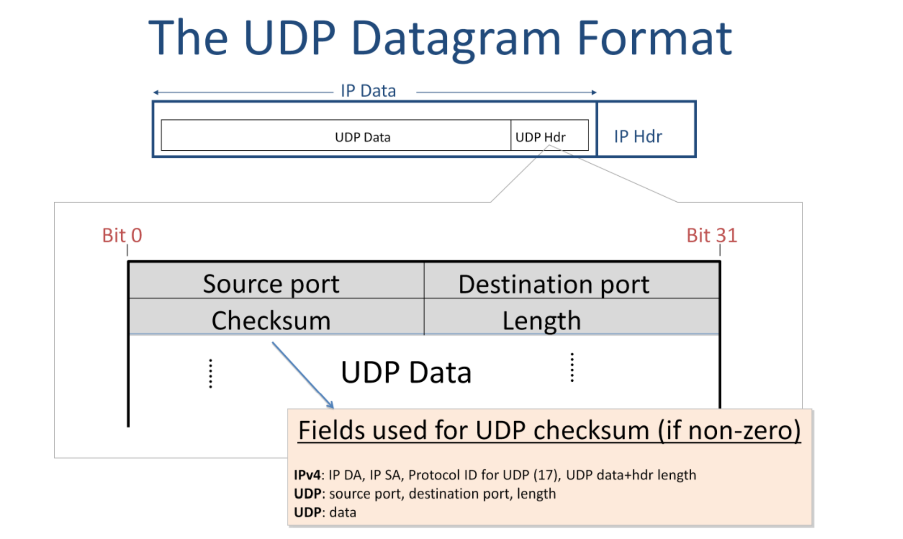

# User Datagram Protocol
* A protocol of Transportation Layer
* no reliable delivery
  * don’t need the guaranteed delivery service of TCP,
* simpler than TCP

## Steps
1. take application data
2. create UDP datagram
3. hands the datagram to network layer

## UDP Datagram Format

* source port
  * indicates which application the data comes from
  * receiver put the port number of source port to destination port
* destination port
  * indicates which application the data should be delivered to at the other end
host.
* checksum
  * optional
    1. If a UDP checksum is not used -> zeroes
    2. If a UDP checksum is used, then it is calculated over the UDP header and data
      * what elements are used for calculation of value of checksum
        1. part of IP header
          1. IP source address
          2. IP destination address
        2. UDP header
        3. UDP Data
* length
  * The 16-bit Length field specifies the length of the whole UDP datagram – header plus data – in
bytes. The value must be at least 8 bytes, because that is the length of the UDP header.

## UDP Overview
* connectionless datagram service
  * no connection is established
  * packets may show up in an any order
* self-contained datagram
  * each datagram has full data???
* an unreliable delivery service
  * has no mechanism to detect missing datagrams.
  * If an entire datagram is dropped along the way, UDP will not inform the application, and it will not ask the source to resend the datagram.
  * application might choose to ask for the data again by itself, essentially building a retransmission mechanism on top of UDP.

## Why UDP
  * used by simple application
    * single request + response
    * examples
      * DNS system
        * each UDP datagram contain all information that you need (hostname -> IP address )
      * DHCP ( Dynamic Host Configuration Protocol)
        * helps a new host find out its IP address when it joins a network.
          * when your laptop connects to Wi-Fi, it uses DHCP 
