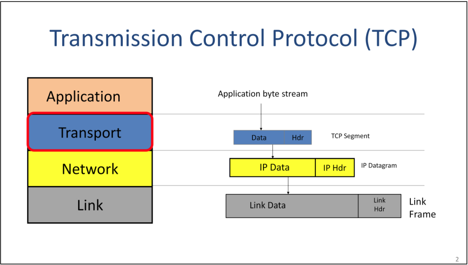
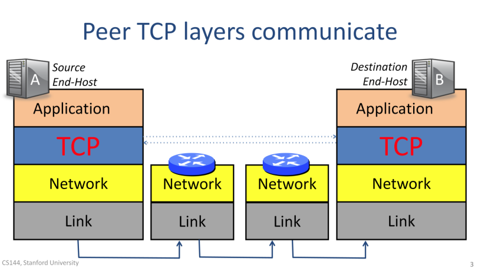
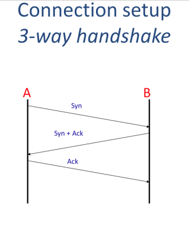
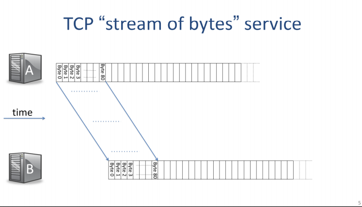
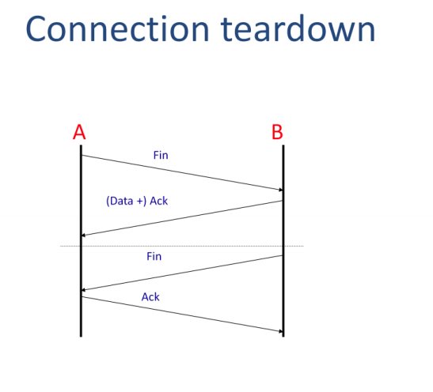
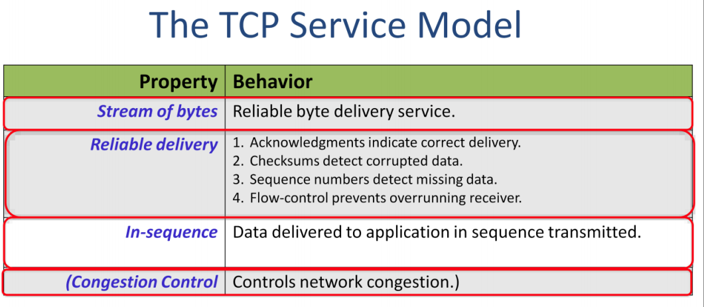
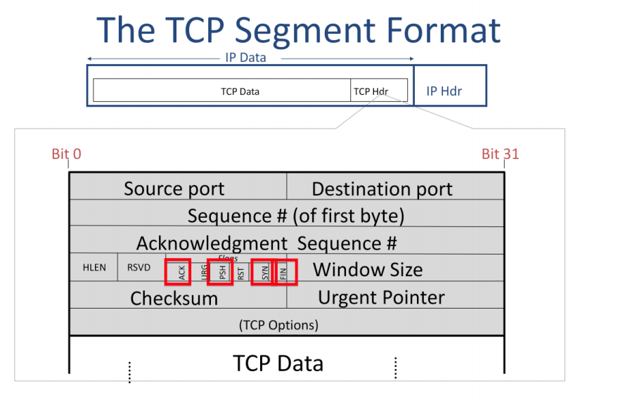

# Transmission Control Protocol
* Feature
  * reliable
  * bi-directional byte stream service
  * in-order
* protocol for transport layer

## 4 Layers Overview

* data transfer vertically and then pass through link layer. At destination, the data send from bottom to top layers.
* Each layer only communicate with it's counterpart respectively.

1. application over the data stream to TCP
2. TCP puts it in to TCP Segment and do some process then put it to IP/Network layer
3. IP layer encapsulates data in IP datagram + IP address
4. IP lager hand data over to Link Layer
  * Link Layer put data in Link Frame
  * Add Link Address (Ethernet Address)
  * Send it to wire.

## Peer TCP layers Communicate

* two way communication === connection
  1. TCP establishes communication channel from A to B
  2. TCP establishes communication channel from B to A
* **State Machine** (in later video)
  * TCP use such machine to track how the connections is doing.

### Three Way handshake

* TCP connection is established using a 3-way handshake between hosts A and B.
* Steps
  1. A send SYN(synchronize) message to B
    * A send message to B to indicate that it's TCP layer would like to connect with layer B's TCP layer.
    * A also send base number (sequence number). (what is this for)
      * to indicate the starting number for the byte stream.
      * example: '0' or '1,000'
  2.  B response SYN + ACK (acknowledge)
    * B agree to establish the communication from A to B
    * B also send a SYN back to A to establish a connection with A's tcp layer (from B to A)
    * B send a base number too.
  3. A responds with an ACK to indicate that it is accepting the request for communication in the reverse direction.

## TCP Stream of Bytes

* The hosts send data to each other as if it is from a continuous stream of bytes.
* Stream of Bytes
  * Example:
    1. static web page
    2. live video
* A and B work together to make sure data delivered correctly in order from A to B.

## Emulation

* In practice
  * you may need send TCP segment multiple times
    * reasons:
      1. Segment may be dropped
      2. A does not receive an acknowledgment
* Size of TCP
  * small as 1 byte
     * ssh session (each character is sent one at a time)
  * large to maximum of ip DATAGRAM SIZE.
    * more efficient.

## Connection Teardown (Close Connection)

* teardown connection
* both ends clean up the sate associated with the state machine
* Steps
  1. Host A send a FIN(finish) message to B
  2. B send
    * ACK
      * acknowledge there are no more data it needs to receive from A
      * acknowledge connection(A to B) is teardown
    * (Optional) left over data.
    * B can still send data to A
  3. B send FIN
    * Tel A can close the close the connection (B to A)
  4. A replies by sending an ACK
  5. now connection is fully closed, both end host can clean state.

## The TCP Service Model

* For Application
  * reliable stream of bytes
* How to be reliable
  1. When TCP layer receive data, it sends ACK back to sender to indicate that the data arrived correctly.
  2. Checksum
    * key in TCP segment header
    * detect corrupted data
      * bit-error on wire
      * memory fault inside a router.
  3. Sequence number (base)
    * exist in header of TCP segment
    * first byte in the segment
    * example:
      * two sides agree the sequence starts at 1,000. The first segment start at 1,000
        * if the first segment carries 500 bytes of data, next segment carry sequence number: 1,500
      * if a segment get lost, the sequence number will get wrong -> TCP knows something wrong.
    * if the data lost, sender has to send that data again.
  4. Flow Control
    * Host A is much faster than Host B
    * Under TCP protocol, receiver keeps telling the sender if it can keep sending
      * receiver tell sender how much space in buffer it can accept new data.
      * stop when buffer is full
* In-sequence
* TCP delivers data to the applicaion in the right Sequence
* if the TCP segments arrive out of order
  * TCP use sequence number to re order it correctly and send it to application.

## The TCP Segment Format

* fields of header
  * destination port
    * which application of the the end host that you should send data to.
    * Host B (your target) identify the application it should establish the connection with.
      * example:
        * HTTP: 80
        * MYSQL: 3306
        * SSH: 22
        * SMTP: 23
  * Source port
    * Tell host B where to send data back
    * Host B should place Host A's source port number in the destination port field.
    * Reopen new connection.
      * When a new connection starts, the initiator of the connection – in our case Host A – generates a unique source port number, so differentiate the connection from any other connections between Host A and B to the same service.
  * The Sequence number
    * indicate the byte stream of TCP Data field start at the place.
      1. initial number: 1000 -> Sequence number is 1,000
      2. Segment has 500 bytes long data -> sequence number of next segment === 1,500
  * The Acknowledgment Sequence Number
    * tells the other end which byte we are expecting next.
    * Say, host B send TCP segment to host A. The segment has Acknowledgment Sequence Number: 750.
      * Next segment sent by Host A should contain sequence number 750.
  * checksum
    * The 16 bit checksum is calculated over the entire header and data, and helps the receiver detect corrupt data.
  * Header Length field
    * tells us how long the TCP header is.
  *  TCP Options fields
    * optional. They carry extra, new header fields that were thought of and added after the TCP standard was created
  * Header Length field
    * tells us how many option fields are present. Usually there are none
  * Flags:
    * ACK: Acknowledgement sequence number is valid and we are acknowledging all of the data up until this point.
    * SYN: part of the 3way handshake to set up the connection
    * FIN: closing of one direction of the connection
    * PSH: tells the TCP layer at the other end to deliver the data immediately to application layer upon arrival, rather than wait for more data.
      * This is useful for short segments carrying time critical data, such as a key stroke. We don’t want the TCP layer to wait to accumulate many keystrokes before delivering them to the application.

## The Unique ID of a TCP connection
  * the connection is identified by five things
  * Five things create the unique ID
    * Identify application process on the end host.
      1. TCP Source port
      2. TCP Destination port
    * Identify the end points
      3. IP Destination Address
      4. IP Source Address
    * Identify Connection
      5. Protocol ID = 'TCP'

  * Valid ID
    * Host a pick a unique source port ID
      * We need to make sure it doesn’t accidentally pick the same source port number it is already using with another connection to the same service on Host B.
      * HOW ?
        * Increment source port number for every new connection
        * The field is 16bits, so it takes 64k new connections before the field wraps round
        * glitch:
          * if Host A suddenly creates a lot of new connections to Host B it might still wrap around
          * solution:
            *  TCP connections initialize with a random initial sequence number to refer to bytes in the byte stream.

## Sequence Number (two different initial sequence number)

1. Host A initiates the connection to B
  * includes the initial sequence number of bytes from A to B.
2. B replies and initiates the connection from B to A
  * supply its own initial sequence number for bytes from B to A

* Sequence Number exist in first bye of the stream
* The sequence number:
  * identifies the byte in the stream of data  from the sending TCP to the receiving TCP that the first byte of data in  this segment represents.
  * The Acknowledgement number field:
    * contains the next sequence number that the sender of the acknowledgement expects to receive. This is therefore the sequence number plus 1 of the last successfully received  byte of data.
    * This field is valid only if the ACK flag is on. Once a connection  is established the Ack flag is always on.

## TCP: Port Demultiplexing (How TCP Port Works)
* Host A send request
* Host B provides two services
  1. web server: port 80
  2. Mail Server: port ??
* Steps
  1. Chrome on Host A request page from Host B
  2. Host A Send request
  3. Establish connection through three way hand shake
  4. Host A generate tcp Segment and put it into IP datagram
    * with local generated source port
    * destination port:  official web port: 80
  5. Host B receive TCP segment
    * send data to web server based on the destination port(80) of data segment
    * put the source port in to destination port of response TCP segment

## References
[Well-known ports](https://en.wikipedia.org/wiki/List_of_TCP_and_UDP_port_numbers#Well-known_ports)
