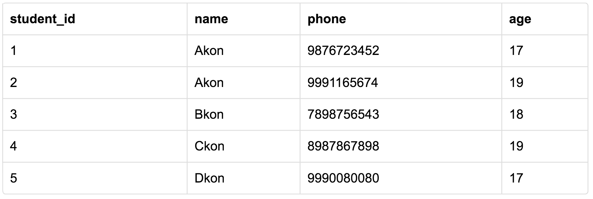

## For What ?
1. used to establish and identify relationships between tables.
2. uniquely identify any record or row of data inside a table.

## Format
1. single attribute
2. a group of attributes

## Student Table

### Super Key
* a set of attributes within a table that can uniquely identify each record within a table

* super key:  ( student_id, (student_id, name), phone )

### Candidate Key
* minimal set of fields which can uniquely identify each record in a table
* candidate keys: (student_id, phone)

### Primary Key
* a candidate key that is most appropriate to become the main key for any table.
* It is a key that can uniquely identify each record in a table.
* primary key: student_id

### Composite Key
* Key that consists of two or more attributes that uniquely identify any record in a table is called Composite key. But the attributes which together form the Composite key are not a key independentely or individually.

### 

## References
[studytonight](https://www.studytonight.com/dbms/database-key.php)
