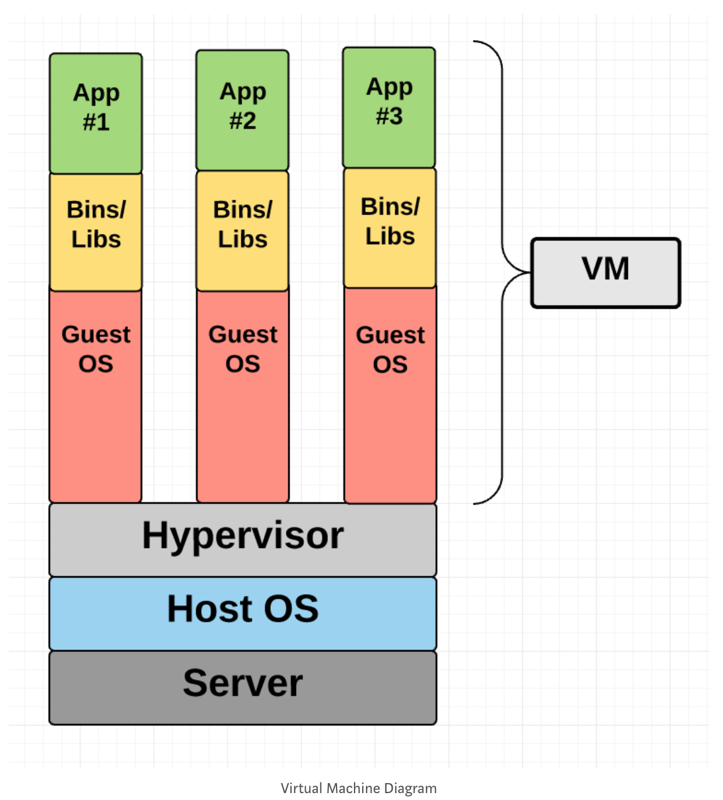
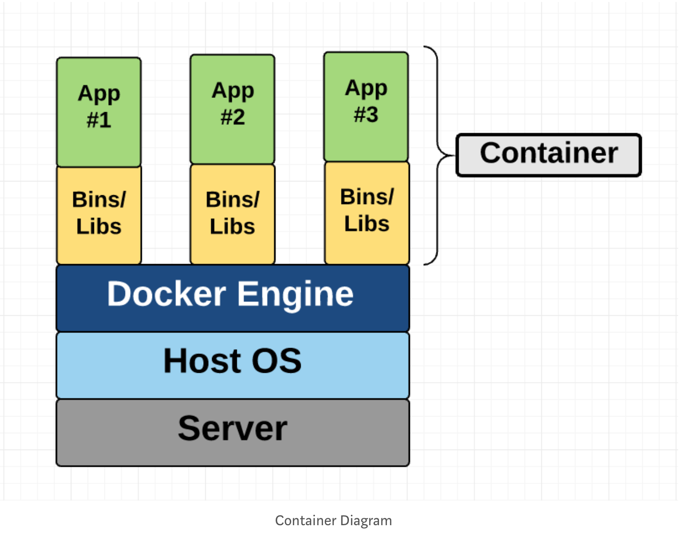

## Introduction

* Containers of Docker
  * Similar to VM: to isolate an application and its dependencies into a self-contained unit that can run anywhere.
  * Container and VM both remove the need for physical hardware, allowing for more efficient use of computing resources, both in terms of energy consumption and cost effectiveness.

## Difference between Container and Virtual Machine
* Architectural  Approach

## Virtual Machine
### VM
* VM runs on top of a physical machine using hypervisor.
* VM also called guest machine
* VM contain the application and whatever the application needs.
* Has full-fledged operating system
  * virtualized network adapters
  * virtual storage
  * virtual CPU

### Hypervisor
  * a software, firmware or hardware
  * Run on physical host machine (physical computer) which provide RAM, CPU, etc. to VM
  * The hypervisor presents the guest operating systems with a virtual operating platform and manages the execution of the guest operating systems.

  * Tow Types
    1. hosted hypervisor
      * a virtualization hypervisor run on the operating system of the host machine.
        * Virtual Box
        * VMware Workstation 8
      * The VM run over hosted hypervisor has no direct access to hardware, it has to go through operating system.
      * The host's operating system responsible for the driver's devices.
      * Benefit:
        * no need to care about the hardware of hosted machine.
        * More compatible
      * Drawback:
        * Additional layer between hardware and hosted hypervisor which is OS of hosted machine.
          * Create more resource overhead to run VM
          * Lower performance of VM
    2. bare-metal hypervisor
      * installing and running from the hosted machine's hardware directly.
      * Dose not need a host's operating system.
      * The hypervisor will be installed as a operating system on the host machine.
      * Has its own device drivers
      * interacts with each component directly for any I/O, processing, or OS-specific tasks.
      * Benefit:
        1. better performance
        2. scalability
        3. stability.
      * Drawback:
        * hardware compatibility is limited
         * hypervisor can only have so many device drivers built into it.

## Docker Container

### Compare to VM

* Like VM
  * private space for processing
  * execute command as root.
  * has private network interface and IP address
  * custom routes and iptable rules
  * can mount file system
* The difference from VM
 * share the host system's kernel with other containers
 * Just pack up the user space (bins, libs, applications...)
 * Each container gets its own isolated user space to allow multiple containers to run on a single host machine.
 * operating system level architecture is being shared across containers, which make it lightweight

### Overview
* open-source project based on Linux containers.
  * namespace
  * control groups
* Advantage
  1. Ease of use
    * portable
    * has everything you need
  2. Speed
    * has no virtual operating system
  3. Docker Hub
    * app store for Docker images.
  4. Modularity and Scalability
    * Docker makes it easy to break out your application’s functionality into individual containers.
    * For example,
     1. container one:  Postgres database
     2. container two:  Redis server
     3. container three: Node.js app
    * With Docker, it’s become easier to link these containers together to create your application, making it easy to scale or update components independently in the future.

### Concept
* Docker Engine
  * manage
    * containers
    * images
  * run natively on Linux
    1. Run docker daemon on in the hose computer
    2. Docker Client (CLI) communicate with docker daemon (JVM) to execute commands
    3. A REST API for interacting with the Docker Daemon remotely
* Docker Client
 * CLI
 * Communicate your instruction to Docker Daemon

* Docker Daemon
  * The Docker daemon is what actually executes commands - like building, running, and distributing your containers.

* Docker File
 * the instructions file to build a Docker image
  * RUN apt-get y install some-package: to install a software package
  * EXPOSE 8000: to expose a port
  * ENV ANT_HOME /usr/local/apache-ant to pass an environment variable
  ...

* Docker Image
 * read only template
 * build by the instructions of docker file
 * define both what you want your packaged application and its dependencies to look like *and* what processes to run when it’s launched.

## File System
  * Different ways of organizing and storing files on a hard drive, flash drive, or any other storage device
  *

## Why We Need Docker on google app engine
* even though app engine is PAAS, we still want to get some degree of ability to customize server env. This is where Docker comes in.

## To Read
 * What is file system
 * What is union file system
 * Why Docker need union file system
 * Rest of the article

## Reference
[Introduction to Docker](https://medium.freecodecamp.org/a-beginner-friendly-introduction-to-containers-vms-and-docker-79a9e3e119b)
