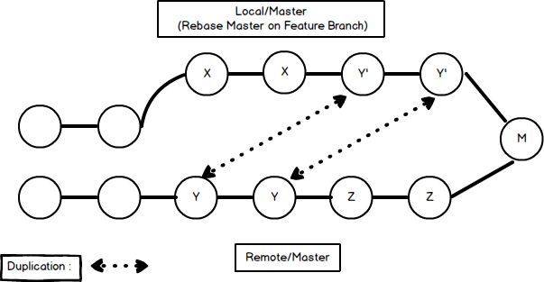

# Merging VS. Rebasing


## Merge
```bash
// Merge master branch into the feature branch

// Solution 1
git checkout feature
git merge master

// Solution 2
git merge master feature
```

### Benefit
* Non-destructive operation.

### Drawback
* Feature branch contain extraneous merge commit.
  * Example: merge commits
* Hard to understand simple git log.

## Rebase (Default: Automated Rebase)
* **Only use it in Private branch.**

```bash
// Rebase the feature branch onto master branch
git checkout feature
git rebase master
```

### Prerequisite
* Rebasing dose not just cut a set of commits and attach it to different branch.
* Rebasing **reapply** all commits.
  * Create new set of commits and keep the old one.
  * Content of both sets are identical, only ids are different.


Please check references at the bottom

### Benefit
* Clean project history.
  * Has no unnecessary merge commits
* Linear project history.
* Use interactive rebasing to clean up cumbersome commit history.

### Drawback
* Lose the context provided by a merge commit.
  * Can't see when upstream changes were incorporated into the feature.
* Lose true history.
  * History tree of project will not indicate feature commits are from feature branch.
  * It is painful to revert commits of feature branch since they are in the master branch now.
    * In merge case, you may just revert merge commit.
    * In rebase case, you have to cherry pick all commits and figure out which commits are from feature branch.

### Interactive Rebasing
```bash
git checkout feature
git rebase -i master

//insde vim
pick 33d5b7a Message for commit #1
fixup 9480b3d Message for commit #2
pick 5c67e61 Message for commit #3

//or
git rebase -i 9480b3d

//or
git checkout feature
git rebase -i HEAD~3
```

### The Golden Rule of Rebasing

#### Don't use it on public/shared branch
ex: Rebase master on feature branch.
* Problems
  * Git will suppose the local master branch history has diverge from everybody else's.
  * Create redundant duplicated commits.

* Force-Pushing
Since on default, git push always in fast-forward, so if git can not push in fast-forward it will prevent four from pushing. Therefore you have to use fore-pushing.

After that you will make things very confusing for the rest of your team. Because the tree is quite different from their local one. So they have to pull the remote repo and get the following tree.



### Rebasing Tips
* If you want to re-write the entire feature, use following commands.
```bash
//Find the breakup point (commit id)
git merge-base feature master
git rebase -i theReturnId
```

## Integrating an Approved Feature
1. Rebase your feature on remote/master.
2. Pull Request
3. Merge feature into master (with Fast-forward method)
3. Result in perfect linear history.


## References
* [Atlassian](https://www.atlassian.com/git/tutorials/merging-vs-rebasing)
* [Drawback of Rebasing](https://stackoverflow.com/questions/10000624/what-are-the-downsides-to-rebasing-topic-branches-instead-of-merging)
* [Rebasing golden rule explained - Pierre de Wulf - freeCodeCamp](https://medium.freecodecamp.org/git-rebase-and-the-golden-rule-explained-70715eccc372)
* [Fast-Forward](https://ariya.io/2013/09/fast-forward-git-merge)
