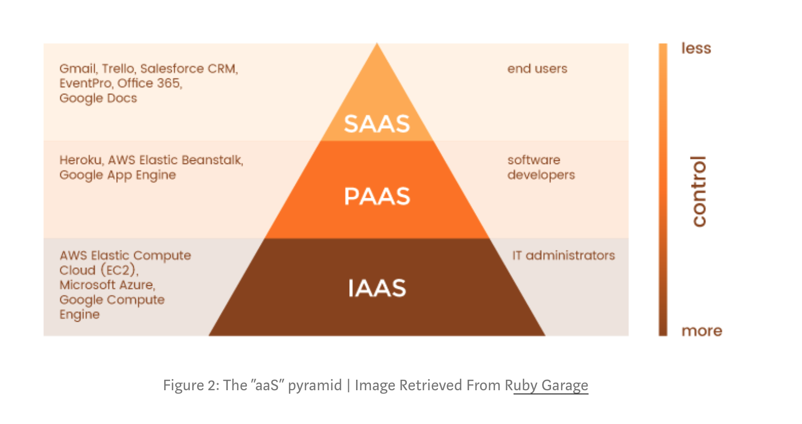

# Google

## [Stack](https://medium.com/google-cloud/gcp-the-google-cloud-platform-compute-stack-explained-c4ebdccd299b)

 
 
 

1. Software as a Service
2. Platform as a Service
3. Infrastructure as a Service

#### Compute Engine vs. Kubernetes Engine
* Compute Engine
  * just infrastructure system which you get an virtual machine
* Kubernetes Engine
  * based on Computer Engine
  * container based (for docker)

## APP Engine V.S Compute Engine
#### App Engine
* Platform-as-a-Service
* simply deploy your code, platform does everything else for you.
* automatically create more instances to handle the increased volume
* downsides
  * not customized

#### Computer Engine
* Infrastructure-as-a-Service.
* flexible
* You have to create and configure your own virtual machine instances
* downsides
  * you have to manage your app and virtual machines yourself.

## Serverless Architecture

##### Google Cloud Services
* app engine
* cloud engine

## Node.js
https://cloud.google.com/nodejs/

## Mongo
* https://cloud.google.com/community/tutorials/mongodb-atlas-appengineflex-nodejs-app
* https://cloud.mongodb.com/user

## [Google Cloud Console](https://console.cloud.google.com/)

## Terms
* cloud shell
  * gcloud
  * a built-in command-line tool for the google console
* 

# Amazon

## serverless Architecture
*  build and run applications and services without having to manage infrastructure
* Your application still runs on servers, but all the server management is
* You no longer have to provision, scale, and maintain servers to run your applications, databases, and storage systems

#### Benefit
* focus on core product
* no need to worry anything about servers
  1. management
  2. operation
  3. runtimes

## References
[nodejs google cloud](https://cloud.google.com/nodejs/?authuser=1)
[Serverless - Amazon](https://aws.amazon.com/lambda/serverless-architectures-learn-more/)
[Serverless - google](https://cloud.google.com/serverless/)
[Computer Engine vs. App Engine](https://stackoverflow.com/questions/22697049/what-is-the-difference-between-google-app-engine-and-google-compute-engine)

## Must Review!!!
[The Google Cloud Platform Compute Stack Explained.](https://medium.com/google-cloud/gcp-the-google-cloud-platform-compute-stack-explained-c4ebdccd299b)
