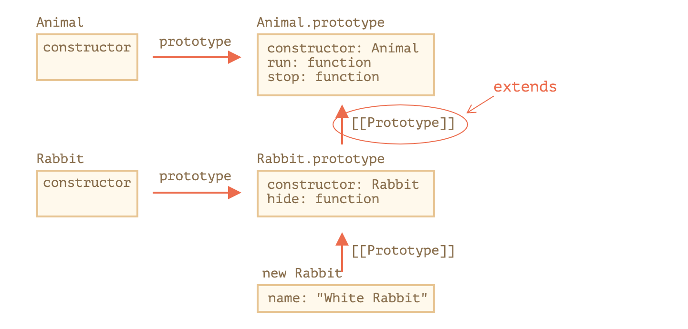

## class Inheritance

### Overview
    * A class is like a blueprint — a description of the object to be created
    * Classes inherit from classes and create subclass relationships: hierarchical class taxonomies.
        * taxonomies (is-a concept)
            * not flexible
            * gorilla banana problem
            * fragile base Class
            * duplication by necessity
            * fallout (rewrite)
    * class syntax
        * class is a sugar syntax based on constructor function in JavaScript
        * class inheritance is implemented on top of prototypal inheritance in JavaScript
    * class is part of prototypal inheritance in JavaScript
    * Instance
        * instantiated via constructor functions/class with the `new` keyword

### Inheritance Example
* single-ancestor parent/child hierarchies
*

```js
class Animal {
  constructor(name) {
    this.speed = 0;
    this.name = name;
  }
  run(speed) {
    this.speed += speed;
    alert(`${this.name} runs with speed ${this.speed}.`);
  }
  stop() {
    this.speed = 0;
    alert(`${this.name} stands still.`);
  }
}


class Rabbit extends Animal {
  hide() {
    alert(`${this.name} hides!`);
  }
}

let rabbit = new Rabbit("White Rabbit");

```



```js
Rabbit.prototype.constructor === Rabbit;
Object.getPrototypeOf(rabbit) === Rabbit.prototype
Object.getPrototypeOf(Object.getPrototypeOf(rabbit)) === Animal.prototype;

```

## Prototypal Inheritance

### Overview
* Prototype
    * A prototype is a working object instance, Objects inherit directly from other objects
    * Instances may be composed from many different source objects
    * class taxonomies are not an automatic side-effect of prototypal OO
* Instance
    * Instances are typically instantiated via factory functions, object literals, or `Object.create()`.

## Three types of Prototypal Inheritance
* concatentive inheritance:
    * mixins: source || prototype
          * has no prototype delegation (prototype chain)
    * The process of inheriting features directly from one object to another by copying the source objects properties
    * syntax
        * `{ ...obj, more, }`
        * `const prototype = {}`
            * `Object.assign({}, prototype|mixin)`
    * benefit
        * object composition
        * flexible

* Prototype delegation - prototype chain
    * JS looking for property in prototype chain until Object.prototype
        * `Object` is a constructor function: `Object.prototype.constructor === Object`
    * Syntax
        1. `Object.create(prototype)` which is factory function
        2. `{ __proto__: prototype }`
        3. `Constructor.prototype.method === {}`
        4. `class extends`
    * benefit:
        * Method delegation can preserve memory resources because you only need one copy of each method to be shared by all instances
    * downside
        * `class extends`: taxonomy
        * others ?

* Functional Inheritance
    * Functional inheritance works by producing an object from a factory function, and extending the produced object by assigning properties to it directly (using concatenative inheritance)
    * Syntax
        ```js
                  // Base object constructor function
          function base(spec) {
              var that = {}; // Create an empty object
              that.name = spec.name; // Add it a "name" property
              return that; // Return the object
          }

          // Construct a child object, inheriting from "base"
          function child(spec) {
              var that = base(spec); // Create the object through the "base" constructor
              that.sayHello = function() { // Augment that object
                  return 'Hello, I\'m ' + that.name;
              };
              return that; // Return it
          }

          // Usage
          var object = child({ name: 'a functional object' });
          result.textContent = object.sayHello();
        ```


* [Classical v.s Prototypal Inheritance](https:// medium.com/javascript-scene/master-the-javascript-interview-what-s-the-difference-between-class-prototypal-inheritance-e4cd0a7562e9)
* [three different prototypal inheritance in JS](https://medium.com/javascript-scene/3-different-kinds-of-prototypal-inheritance-es6-edition-32d777fa16c9)
* [functional inheritance example](http://julien.richard-foy.fr/blog/2011/10/30/functional-inheritance-vs-prototypal-inheritance/)
