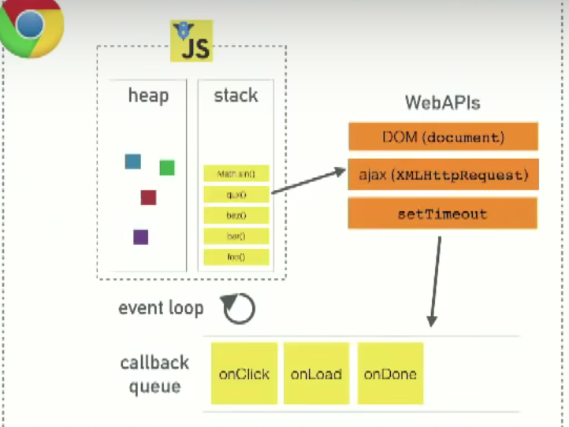
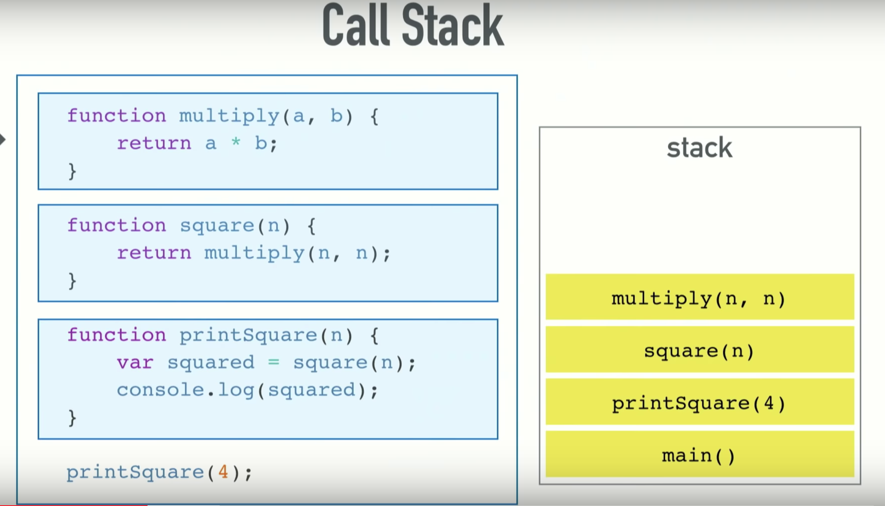
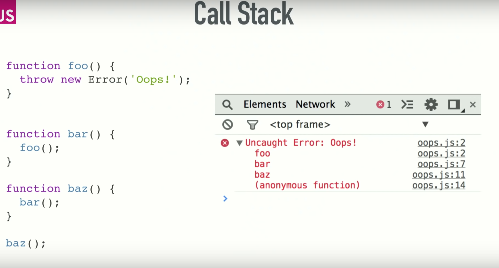
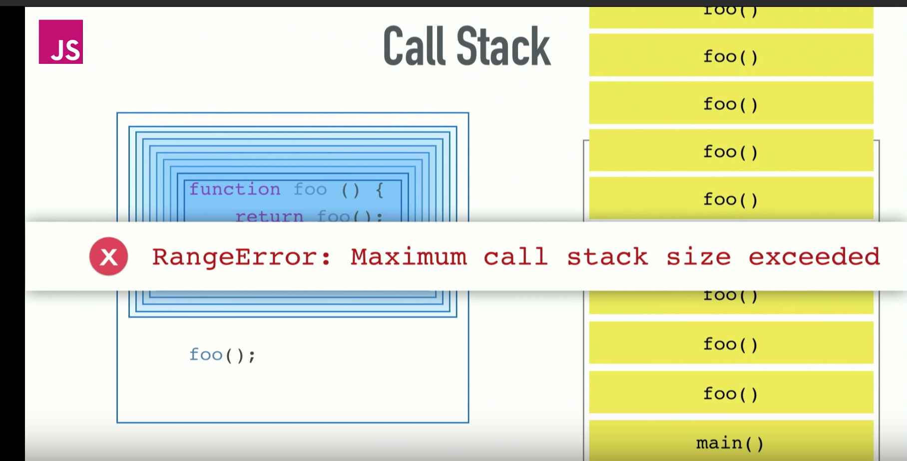
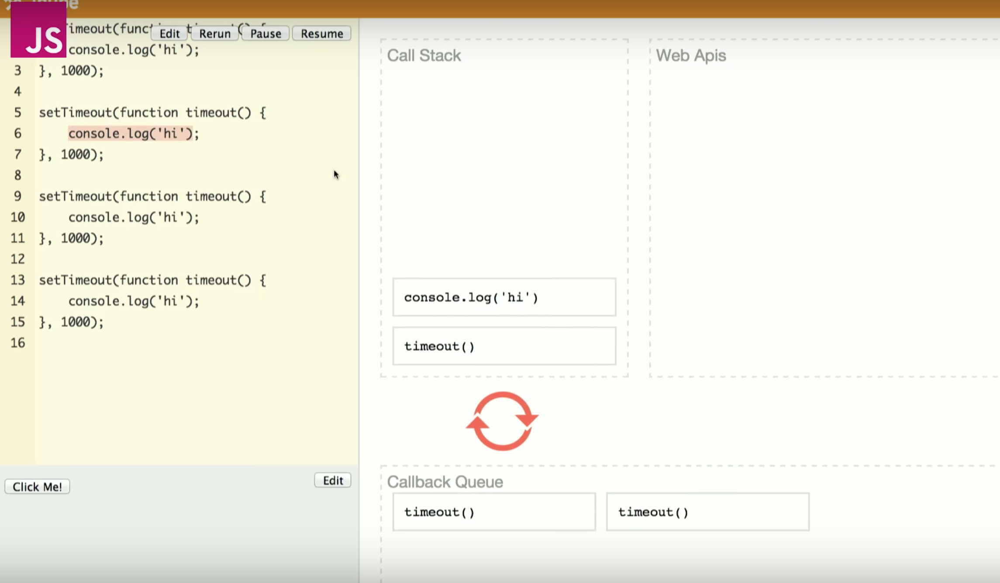

# Event Loop

## Prerequisite

### JavasScript
* single thread, non-blocking, asynchronous, concurrent language
* call stack, event loop, callback/task queue + other apis
    * apis (browser)
        * fetch / ajax
        * setTimeout
        * DOM manipulation
    *  call stack/heap (V8)

### runtime system
* overview
    * also called runtime env
    * the system that provides the platform for program language to run on
    * handle compilation and ececution
* essential elements
    * call stack + heap
* responsibilities
    * manage stack + heap
    * memory allocation -> garbage collection
    * threads (single-thread in javascript)
    * offer some other dynamic / library features

### V8
* overview
    * JavaScript / WebAssembly engine
    * a run time system
    * written in c++
    * used in chrome, node.js, etc.

* what it does
    1. Compiles and executes JS code
    2. Handling call stack — running your JS functions in some order
        * single thread
    3. Managing memory allocation for objects — the memory heap
    4. Garbage collection — of objects which are no longer in use
    5. Provide all the data types, operators, objects and functions

* can
    * Provide the event loop, but this is sometimes implemented by the browser as well

* can't
    * manipulate DOM

### Stack V.S. Heap

* need to elaborate more.

|   |  Stack | Heap |
| --- | --- | --- |
| Basic | LIFO - allocated in Contiguous Block | allocated in random order |
| Access Time | Faster | slower (need pointers) |
| Allocation | by compiler | manually |

## Let's get started (Event Loop)
* heap + stack + WebAPIs + event loop + callback queue

### Call Stack
* LIFO
* handle order of **called** functions

* one thread == single call stack == one thing at a time

* scenarios
    1. normal
    

    2. callstack state
    

    3. callstack memory size exceeded
    

### Problem: Blocking
* synchronous requesting (http request) is time consuming, which cause blocking effect on browser.
    * user can't have any interaction during the requests
    * bad UX

### Solution for blocking
    * asynchronous callbacks
        * which is done by event loop + task queue

### Concurrency & Event Loop
* event loop
    * check call stack + task queue
        * if call stack is empty, it fetch a thing from task queue and push it into call stack.

### setTimeout(cb, 0)
* to defer something until call stack is clear
    * example: pause" the JavaScript execution to let the rendering threads of browser to catch up

### setTimeout
* is not guaranteed time to execution
* it is a minimum time to execution
* example: multiple setTimeouts

### Callback
* a function that is called by other function later
* a async function that is pushed into task queue for later execution

## Questions
1. what is v8
2. what is runtime

## Ref
* [event loop - JSCONF](https://www.youtube.com/watch?v=8aGhZQkoFbQ&list=PLobKQ3Px0g7CkUD7RQ5Kwf8uo7mLI_G7E&index=3&t=1296s)
* [runtime system - wiki](https://en.wikipedia.org/wiki/Runtime_system)
* [v8 - medium](https://hackernoon.com/javascript-v8-engine-explained-3f940148d4ef)
* stack Heap
    * https://gribblelab.org/CBootCamp/7_Memory_Stack_vs_Heap.html
    * https://www.geeksforgeeks.org/stack-vs-heap-memory-allocation/
    * https://medium.com/fhinkel/confused-about-stack-and-heap-2cf3e6adb771
* [wht is setTimeout(0) for](https://stackoverflow.com/questions/779379/why-is-settimeoutfn-0-sometimes-useful)
