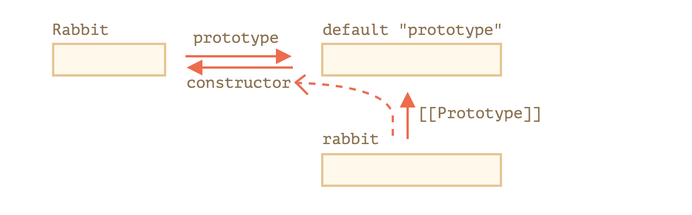
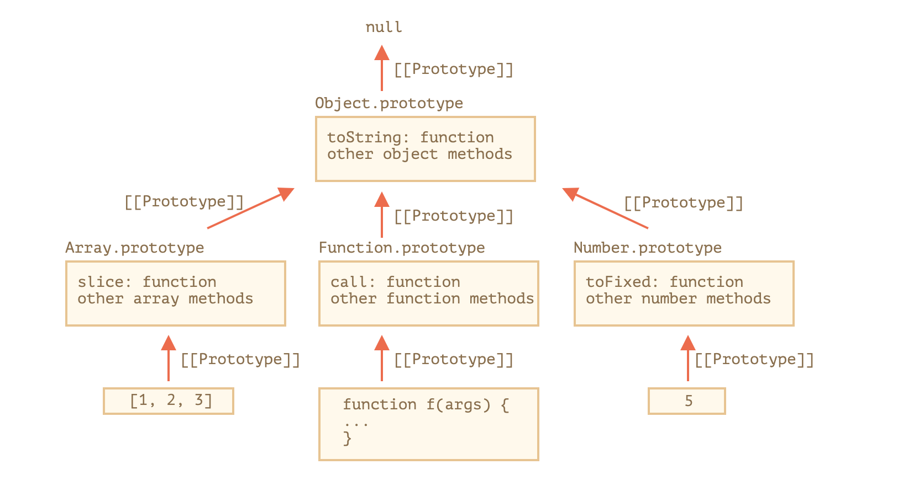

# Prototype Delegation Except Class

## Overview
* object
    * __proto__
    * methods
* Constructor Function
* Native


## Example
* Mammal
    * eats()
    * breath()
* Bird
    * fly()
* Rabbit
    * jump()


## Examples

### Literal + __proto__

```js

// manipulate __proto__ propertoy of objects directly

const mammal = {
  eats() {
    console.log('I eat.');
  },
  breath() {
    console.log('I breath.');
  }
}

const rabbit = {
  __proto__: mammal,
  jump() {
    console.log('I jump.')
  }
}

console.log(rabbit.__proto__ === mammal); // true


```

### Literal + methods
* Object.getPrototypeOf
* Object.setPrototypeOf
* Object.create
* Object.hasOwnProperty

```js

const mammalPrototype = {
  eats() {
    console.log('I eat.');
  },
  breath() {
    console.log('I breath.');
  }
}

const birdPrototype = {
  fly() {
    console.log('I can fly.');
  }
}

const rabbit = Object.create(mammalPrototype);

rabbit.jump = function() {
  console.log('I jump.');
}

console.log(rabbit.__proto__ === mammalPrototype);  // true
console.log(Object.getPrototypeOf(rabbit) === mammalPrototype);  // true

Object.setPrototypeOf(rabbit, birdPrototype);

console.log(Object.getPrototypeOf(rabbit) === mammalPrototype);  // false
console.log(Object.getPrototypeOf(rabbit) === birdPrototype);  // true
console.log(Object.getPrototypeOf(rabbit).__proto__ === Object.prototype); // true
console.log(rabbit.hasOwnProperty('jump')); // true
console.log(rabbit.hasOwnProperty('fly')); // false

```

### Construction Function




```js


function Mammal(name) {
  this.name = name;
}

Mammal.prototype.eat = function() {
  console.log('I eat!');
}
Mammal.prototype.breath = function() {
  console.log('I breath!');
}

function Rabbit(isLongear, name) {
  this.isLongear = isLongear;
  Mammal.call(this, name);
}

Rabbit.prototype = {
  constructor: Rabbit,
  jump() {
    console.log('I jump');
  }
};

const mammalInstance = new Mammal();

Object.setPrototypeOf(Rabbit.prototype, mammalInstance);

const rabbit = new Rabbit(false, 'Han')

rabbit.eat(); // I eat!
console.log(rabbit.__proto__ === Rabbit.prototype); // true
console.log(rabbit.__proto__.constructor === Rabbit); // true
console.log(rabbit.__proto__.__proto__ === mammalInstance); // true
console.log(rabbit.__proto__.__proto__.__proto__ === Mammal.prototype); //true


```


### Native


