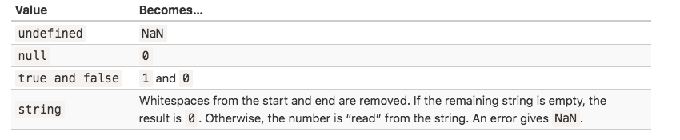

## Type Conversion
* automatical type conversion
  * alert switch type form number to string
  * mathematical operations convert values to numbers
* Manual type conversion
 * String()
 * Number()


## ToString
* String()
```js
String(value)
// false -> 'false'
// null -> 'null'
```
* convert everything into string even the null, undefined values type.

## ToNumber
* Number()

```js
alert( "6" / "2" ); // 3, strings are converted to numbers

let str = "123";
alert(typeof str); // string

let num = Number(str); // becomes a number 123

alert(typeof num); // number
Explicit
```

* if the string is not valid number, the result of such a conversion is NaN

```js
let age = Number("an arbitrary string instead of a number");
alert(age); // NaN, conversion failed
```


* Almost all mathematical operations convert values to numbers
 * except +

```js
1 + '12' = '112'
```

## ToBoolean
* happens only in logical operations
* Boolean(value)

* cases
  * false
    1. undefined -> false
    2. '' -> false
    3. null -> false
    4. "empty" -> false
    5. NaN -> false
    6. 0 -> false
  * true
    * others

```js
Boolean('0') // true
Boolean(' ') // true
```


## Tasks
1. '10'
2. -1
3. 1
4. 2
5. 6
6. '45px' xxxx
7. '$45'
8. 2
9. Nan - 2 => NaN ?
10. Infinity
11. '-95'
12. -14
13. 1
14. NaN

* 4 + 5 + 'px' -> '9px'
