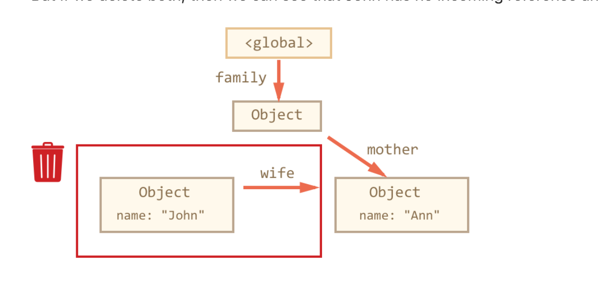
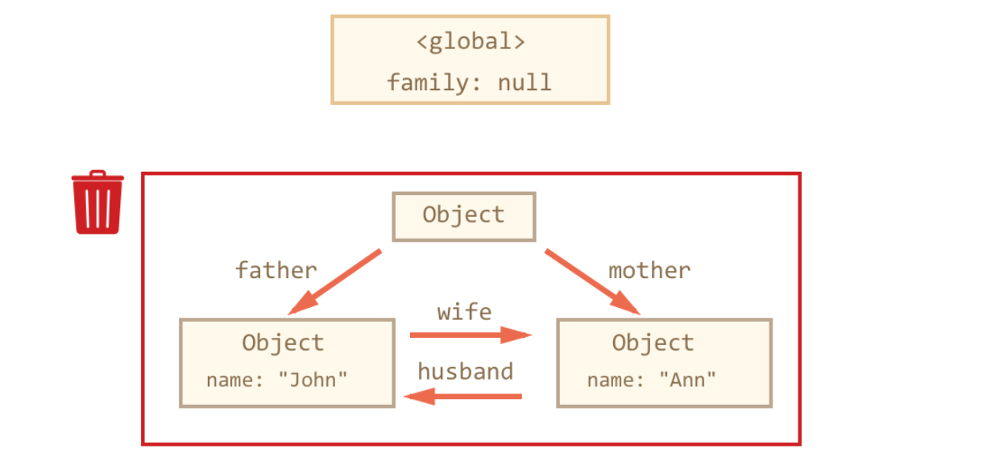

## reachability
* things that are accessible
  * they are guaranteed to be stored in memory

* Value that consider reachable
  * Root value
    1. Local variables and parameters of the current function.
    2. Variables and parameters for other functions on the current chain of nested calls.
    3. Global variables
    4. (there are some other, internal ones as well)
  * Any other value is considered reachable if it’s reachable from a root by a reference or by a chain of references.
    * if a local variable assigned with an object. A property of the object reference to another object 'B'. The object B is considered reachable.

* garbage collector
  * running in the background
  * monitoring all objects and remove those that have become unreachable.

## Single Reference Example

* the global variable user reference to the object `{ name: John}`

```js

let user = {
  name: 'John'
}

```

* Assign null to the global variable user.

```js

user = null

```

* now the object `{ name: user }` can be removed and free the memory.


## Two References Example

* Copy reference from user to admin
* Even though we assign null to user, the admin variable still reference to the object `{ name: John }`. So the object will still exist in the memory.

```js
let user = {
  name: 'John'
};

let admin = user;

user = null;


```

## Interlinked Objects
* only incoming reference can make object reachable.
  * the outgoing reference can keep object alive.

```js

function marry(man, woman) {
  woman.husband = man;
  man.wife = woman;

  return {
    father: man,
    mother: woman
  }
}

let family = marry({
  name: "John"
}, {
  name: "Ann"
});


delete family.father;
delete family.mother.husband;

// after two deletes, the object {
// name: 'John',
// wife: a reference
// }

// can be collect by garbage collector
```



```js

family = null

```



## Summary

* Garbage collection is performed automatically. We cannot force or prevent it.
* Objects are retained in memory while they are reachable.
* Being referenced is not the same as being reachable (from a root): a pack of interlinked objects can become unreachable as a whole.
