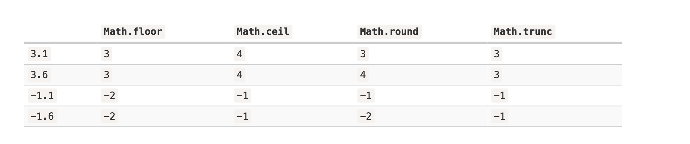

## Numbers

* usual way

```js
let a = 1234;
```

* I forget the term

```js

let billion = 1e9;
let oneMillionSecond = 1e-6;

```

* Hexadecimal

```js

let oneHundredAndSeventySeven = 0xb1;

```

* Binary

```js

let five = 0b101;

```

* Octal

```js

let thirtyThree = 0o41;

```

## toString
* returns a string representation of num in the numeral system with the given base.
* default is 10

```js
let num = 255;

alert( num.toString(16) );  // ff
alert( num.toString(2) );   // 11111111
```

* call the method on nubmer directly

```js

177..toString(16);

```

## Rounding

* Math.floor
* Math.ceil
* Math.round
* Math.trunc



* Round number to n-th digit after the decimal.

```js

/* solution */
Math.floor(num * 100) / 100

```

* toFixed
  * return `string`
  * Works like Math.round
  *  If the decimal part is shorter than required, zeroes are appended to the end

## Imprecise Calculation
* 64 bits to store number
  * 52 bits for (number)
  * 11 bits for indicating the position of the decimal point (they are zero for integer numbers)
  * 1 bit for sign

* overflow -> infinity

```js

1e500 // infinity

```
* divided by 10 in binary system will become endless fraction

```js
0.1 + 0.2  // 0.30000000000000004
0.1 + 0.3 !== 0.3 // true
```

* Solution for this

```js

/* solution one */
let a = 0.3..toFixed(2);

+a // 0.3


/* solution two  */

 (0.1 * 10 + 0.2 * 10) / 10


```

## tricky cases

```js
9999999999999999 // 10000000000000000

```

## Special Value
* Following value belong to type number
  * Infinity
  * -Infinity
  * NaN


```js

isNaN(NaN) //true
isNaN(Infinity) //false
isNaN(-Infinity) //false

```

```js

NaN === NaN  // false

```

* isFinite

```js

alert( isFinite("15") ); // true
alert( isFinite("str") ); // false, because a special value: NaN
alert( isFinite(Infinity) ); // false, because a special value: Infinity
```

## parseInt / parseFloat

* convert string to number in strict way
  1. +
  2. Number()

```js

// strict

Number('str') // NaN
+'str' //NaN

```

* convert string to number in soft way

```js
alert( parseInt('100px') ); // 100
alert( parseFloat('12.5em') ); // 12.5

alert( parseInt('12.3') ); // 12, only the integer part is returned
alert( parseFloat('12.3.4') ); // 12.3, the second point stops the reading

```

  * if the number has no digits can be converted

  ```js

  alert( parseInt('a123') ); // NaN, the first symbol stops the process

  ```

* parseInt(str, radix/base)

```js

alert( parseInt('0xff', 16) ); // 255
alert( parseInt('ff', 16) ); // 255, without 0x also works

alert( parseInt('2n9c', 36) ); // 123456

```

## Other Methods
* Math.random()
* Math.max()
* Math.min()
* Math.pow()
