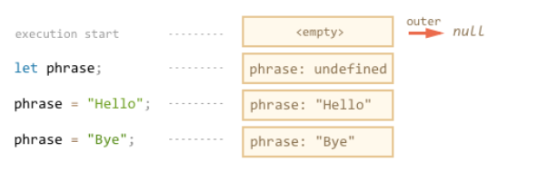
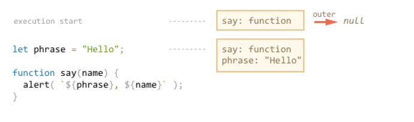
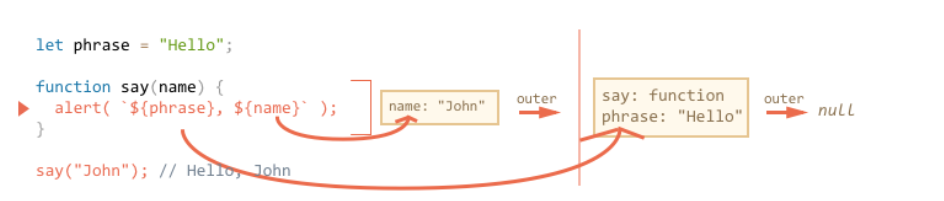
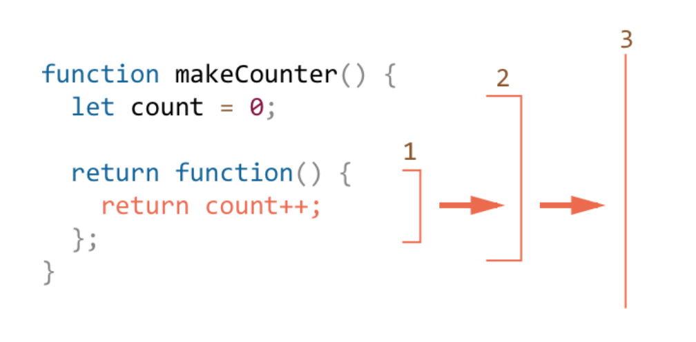
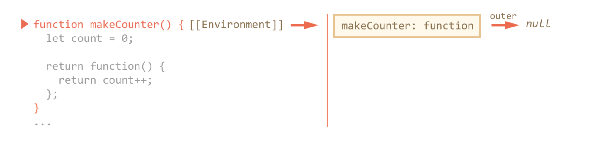
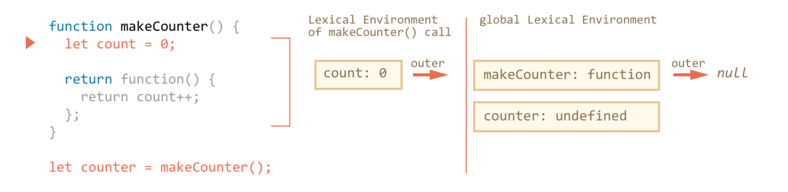
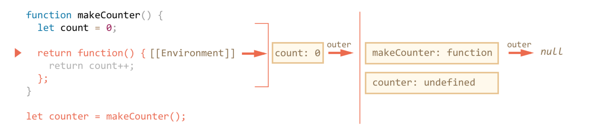
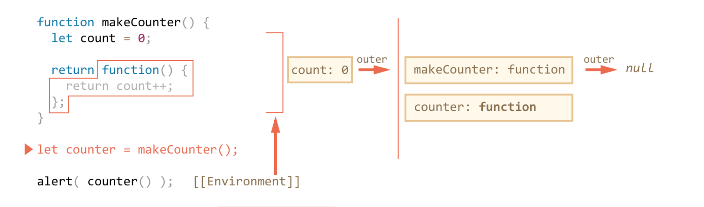
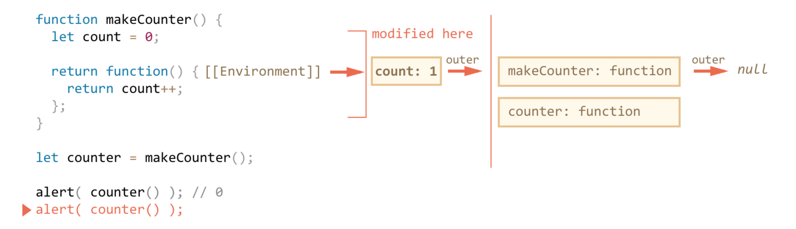
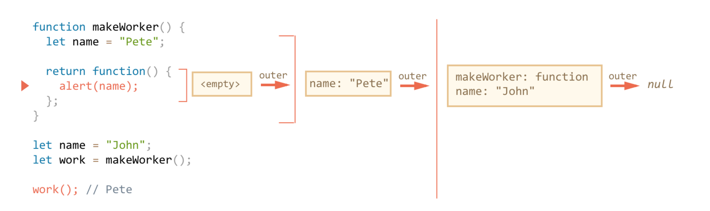

## Lexical Environment Object
* Who kind of conditions, create such object
  1. running function: function() {}
  2. whole script (Global Lexical Environment)
  3. code block

* Properties of Lexical Environment Object
  1. Environment Record:
    1. local variables
    2. this value
    * if you change a value of variable, it just like change the value of specific property of Lexical Environment Object.
  2. reference to outer lexical environment




## Tmp Conclusion
* A variable is a property of a special internal object, associated with the currently executing block/function/script.
* Working with variables is actually working with the properties of that object.

## Function Declaration
* function declaration exist in the lexical environment before the execution.

* Execute
  1. create function declaration in lexical environment
  2. execute to the rest of variables
  3. create those properties in lexical environment.




## Inner + Outer Lexical environment

* The inner Lexical Environment corresponds to the current execution of say.
 - It has a single variable: name, the function argument. We called say("John"), so the value of name is "John".

* The outer Lexical Environment is the global Lexical Environment.
 - It has phrase and the function itself.




## Caveat
### One call – one Lexical Environment
* invoking a function create a lexical environment
* invoking same function multiple times, each invocation has its own lexical environment.

### Lexical Environment is a specification object
* we can't get it and manipulate it.
* javascript may optimize it.
  * remove unused variable to save memory.

## Nested Functions
```js
/* ----- example 1 ----- */
function sayHiBye(firstName, lastName) {

  // helper nested function to use below
  function getFullName() {
    return firstName + " " + lastName;
  }

  alert( "Hello, " + getFullName() );
  alert( "Bye, " + getFullName() );

}

/* ----- example 2 ----- */
// constructor function returns a new object
function User(name) {

  // the object method is created as a nested function
  this.sayHi = function() {
    alert(name);
  };
}

let user = new User("John");
user.sayHi(); // the method "sayHi" code has access to the outer "name"

/* ----- example 3 ----- */
function makeCounter() {
  let count = 0;

  return function() {
    return count++; // has access to the outer counter
  };
}

let counter = makeCounter();

alert( counter() ); // 0
alert( counter() ); // 1
alert( counter() ); // 2

```



* the count was found in makeCounter's lexical environment 2
* the only way to modify variable count is that export another function that modify the variable count in makeCounter's lexical environment.
* each counter instance/function makes from makeCounter() is independent.


## Environments in Detail (makeCounter)
1. Start script
  * javascript create global lexical environment
* All functions on birth receive hidden property
  * [[Environment]]
    * the reference for the lexical environment

2. create the lexical environment for makeCounter function.
  * the outer of LE is set to [[Environment]] of the function.
  * has local variable count.

* After you get counter form makeCounter(). Even though it seems that makeCounter vanish after you invoke it. The lexical environment of makeCounter still exist because the variable in counter function make a reference to count in makeCounter.

* Generally, a Lexical Environment object lives as long as there is a function which may use it. And only when there are none remaining, it is cleared.

* if you use/invoke makeCounter to declare multiple functions, you will create multiple lexical environments for each invoked makeCounter. Therefore, you can create private variables










* Private Variable



## Closure
* Definition:
  closure is a function that remembers its outer variables and can access them.
* Javascript:
  * All functions are naturally closure.
  * Exception: new Function('a', 'b', 'return a + b')
  * [[Environment]]
  * Lexical Environment
